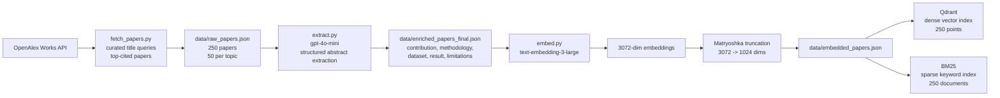

# Research Synthesis Engine

Research Synthesis Engine is a literature intelligence system for academic papers. It ingests top-cited research papers from OpenAlex, extracts structured metadata from abstracts, builds dense and sparse retrieval indexes, and generates confidence-gated research briefs, inspectable evidence matrices, reading paths, and grounded open-problems reports.

Users can choose a research area, pick a suggested question, or ask a free-text research question such as:

```text
What are the main approaches for reducing hallucinations in LLMs?
```

The final product output will be:

- Direct answer
- Research themes
- Evidence matrix
- Recommended reading path
- Open problems
- Optional timeline

## Project Status

**Phase 1: Ingestion & Indexing — Complete**  
**Phase 2: Route-Aware Retrieval — Complete**  
**Phase 3: Evaluation & Grounded Synthesis — In Progress**

The offline ingestion and indexing pipeline is implemented and validated. Route-aware retrieval can choose paper-level search, full-text chunk search, both result sets, or metadata filtering for free-text user questions. Grounded synthesis now uses the CRAG confidence check before producing a research brief. Evidence matrices, reading paths, and open-problems reports can be generated from the same retrieved evidence without duplicate retrieval calls.

```text
OpenAlex fetch
→ raw paper corpus
→ LLM metadata extraction
→ enriched paper corpus
→ OpenAI embeddings
→ Matryoshka truncation
→ Qdrant dense index
→ BM25 sparse index
```

## Ingestion Pipeline Architecture



## Dataset

The corpus contains 250 academic papers across 5 research areas:

| Research Area | Papers |
| --- | ---: |
| Retrieval-Augmented Generation (RAG) | 50 |
| Transformers / Attention Mechanisms | 50 |
| LLM Evaluation & Hallucination Detection | 50 |
| AI Agents & Tool Use | 50 |
| Fine-tuning (LoRA / PEFT) | 50 |

Papers are fetched from OpenAlex using curated title-query aliases, sorted toward highly cited works, deduplicated globally, and filtered to require a title and reconstructable abstract.

## Data Artifacts

| Artifact | Description |
| --- | --- |
| `data/raw_papers.json` | Raw OpenAlex paper metadata and abstracts |
| `data/enriched_papers_final.json` | LLM-extracted structured metadata |
| `data/embedded_papers.json` | 1024-dimensional truncated embeddings plus metadata |
| `data/bm25_index.pkl` | Local BM25 sparse retrieval index |
| `data/full_text_sources.json` | Discovered legal open full-text PDF sources |
| `data/full_text_selected.json` | Topic-balanced full-text subset selected for PDF extraction |
| `data/full_text_papers.json` | Download/extraction results for available full-text PDFs |
| `data/full_text_chunks.json` | Section-hinted chunks from successful full-text extractions |
| `data/embedded_full_text_chunks.json` | 1024-dimensional full-text chunk embeddings |
| `data/pdfs/` | Local downloaded PDF files |
| Qdrant `research_papers` collection | Dense vector index with 250 points |
| Qdrant `research_paper_chunks` collection | Chunk-level full-text vector index with 4,170 points |

## Structured Metadata

Each enriched paper includes:

```text
title
abstract
authors
citation_count
year
topic
main_contribution
methodology
dataset_used
key_result
limitations
```

The extraction prompt uses `"not stated in abstract"` when a dataset, key result, or limitation is not stated in the abstract. Survey-style papers naturally contain more of these values because their abstracts summarize a field rather than report one specific experiment.

Example enriched record:

```json
{
  "title": "Attention Is All You Need",
  "topic": "Transformers / Attention Mechanisms",
  "citation_count": 6583,
  "year": 2025,
  "main_contribution": "Proposing the Transformer architecture based solely on attention mechanisms.",
  "methodology": "Experiments on machine translation tasks.",
  "dataset_used": "WMT 2014 English-to-German and English-to-French translation tasks.",
  "key_result": "Achieving state-of-the-art BLEU scores of 28.4 and 41.8 on respective tasks.",
  "limitations": "not stated in abstract"
}
```

## Retrieval Foundation

The project now has both retrieval indexes needed for hybrid search:

- **Dense retrieval:** Qdrant collection `research_papers`, 250 vectors, cosine distance, 1024 dimensions
- **Sparse retrieval:** BM25 index over the same 250-paper corpus
- **Hybrid retrieval:** `retrieval.hybrid_search` embeds a user question, searches Qdrant and BM25, merges duplicate papers, and returns ranked candidates with dense, sparse, and hybrid scores
- **Tool interface:** `tools.research_retrieval` validates request/response schemas and returns JSON for downstream API, agent, or UI layers
- **Unified retrieval:** `retrieval.unified_search` routes each query, returns paper and/or chunk results, and attaches rerank/citation-aware score fields
- **Confidence-gated synthesis:** `agent.synthesis` generates a grounded brief only when retrieved evidence passes the CRAG confidence check
- **Evidence matrix:** `agent.evidence_matrix` turns retrieved evidence into inspectable claim/source rows with methodology, dataset, result, limitation, and strength fields
- **Reading path:** `agent.reading_path` recommends a grounded 5-10 paper sequence across foundations, methods, evaluation, recent advances, and limitations
- **Open problems:** `agent.open_problems` derives unresolved problems from retrieved limitations, future-work signals, and evidence gaps
- **Combined guidance:** `agent.research_guidance` reuses one unified retrieval response and confidence assessment for both Day 19 outputs

Hybrid query example:

```bash
python -m retrieval.hybrid_search "What are the main approaches for reducing hallucinations in LLMs?" --final-top-k 5
```

Dense sanity query:

```text
hallucination detection in large language models
```

returned relevant papers from `LLM Evaluation & Hallucination Detection`, including hallucination surveys and detection methods.

BM25 sanity query returned relevant papers such as:

```text
A Survey on Hallucination in Large Language Models
SelfCheckGPT: Zero-Resource Black-Box Hallucination Detection
HaluEval: A Large-Scale Hallucination Evaluation Benchmark
```

## Full-Text Source Discovery

The project includes a source discovery step for legal open PDFs. It checks existing arXiv links first, then queries OpenAlex for open-access PDF locations.

Current local discovery result:

```text
full-text sources checked: 250
full-text available: 173
arXiv sources: 49
OpenAlex open-access PDF sources: 124
unavailable: 77
```

Available full-text papers by topic:

| Research Area | Full Text Available |
| --- | ---: |
| Retrieval-Augmented Generation (RAG) | 40 |
| Transformers / Attention Mechanisms | 26 |
| LLM Evaluation & Hallucination Detection | 39 |
| AI Agents & Tool Use | 35 |
| Fine-tuning (LoRA / PEFT) | 33 |

This is enough to build a 100-150 paper full-text subset while keeping all 250 papers in the abstract-level index.

Full-text extraction result:

```text
legal PDF sources attempted: 173
successfully extracted full-text papers: 131
failed downloads/extractions: 42
total extracted pages: 2533
total extracted text characters: 10343086
```

Successful full-text papers by topic:

| Research Area | Extracted Full Text Papers |
| --- | ---: |
| Retrieval-Augmented Generation (RAG) | 27 |
| Transformers / Attention Mechanisms | 20 |
| LLM Evaluation & Hallucination Detection | 31 |
| AI Agents & Tool Use | 25 |
| Fine-tuning (LoRA / PEFT) | 28 |

Most failures were publisher-side download blocks such as `403 Forbidden`; those papers remain available through the abstract-level index.

Full-text chunk index:

```text
full-text papers chunked: 131
full-text chunks: 4170
chunk embedding model: text-embedding-3-large
stored chunk embedding dimensions: 1024
Qdrant chunk collection: research_paper_chunks
Qdrant chunk points: 4170
```

Chunk retrieval is used for detailed evidence questions such as datasets, metrics, methods, results, and limitations.

## Validation

Current validated numbers:

```text
raw papers: 250
enriched papers: 250
embedded papers: 250
paper-level Qdrant points: 250
BM25 documents: 250
full-text chunks: 4170
chunk-level Qdrant points: 4170
stored embedding dimensions: 1024
full embedding dimensions from OpenAI: 3072
tests: 151 passed
```

These counts reflect the current local artifacts, index checks, and test suite.

## Tech Stack

- Python
- OpenAlex API
- `gpt-4o-mini` for abstract extraction
- `text-embedding-3-large` for embeddings
- Qdrant for dense vector search
- BM25 via `rank-bm25` for sparse search
- Pydantic for schema validation
- Docker Compose for local Qdrant
- Pytest with mocked external API paths

## Local Setup

```bash
python -m venv .venv
source .venv/bin/activate
pip install -e ".[dev]"
cp .env.example .env
```

Required `.env` values for full rebuilds:

```bash
OPENAI_API_KEY=
QDRANT_URL=http://localhost:6333
OPENALEX_API_KEY=
OPENALEX_EMAIL=
```

## Rebuild Commands

Fetch papers:

```bash
python -m ingestion.fetch_papers --per-topic 50 --output data/raw_papers.json
```

Extract structured metadata:

```bash
python -m ingestion.extract --model gpt-4o-mini
```

Generate embeddings:

```bash
python -m ingestion.embed --model text-embedding-3-large --batch-size 32
```

Start Qdrant:

```bash
docker compose up -d qdrant
```

Index Qdrant:

```bash
python -m retrieval.index_qdrant
```

Build BM25:

```bash
python -m retrieval.build_bm25 --query "hallucination detection in large language models"
```

Dense search sanity check:

```bash
python -m retrieval.search_qdrant "hallucination detection in large language models"
```

Hybrid retrieval query:

```bash
python -m retrieval.hybrid_search "What are the main approaches for reducing hallucinations in LLMs?" --final-top-k 5
```

Tool-style JSON retrieval:

```bash
python -m tools.research_retrieval "What are the main approaches for reducing hallucinations in LLMs?" --top-k 5
```

Route-aware unified retrieval:

```bash
python -m retrieval.unified_search "Which datasets and metrics are used to evaluate hallucination detection?" --top-k 5
```

Discover open full-text sources:

```bash
python -m full_text.discover_sources --input data/enriched_papers_final.json --output data/full_text_sources.json
```

Select the full-text subset:

```bash
python -m full_text.select_sources --input data/full_text_sources.json --output data/full_text_selected.json --per-topic 25
```

Download and extract full-text PDFs:

```bash
python -m full_text.download_extract --input data/full_text_selected_all.json --output data/full_text_papers.json --pdf-dir data/pdfs --append-existing
```

Chunk extracted full text:

```bash
python -m full_text.chunk_papers --input data/full_text_papers.json --output data/full_text_chunks.json --max-words 450 --overlap-words 75
```

Embed full-text chunks:

```bash
python -m full_text.embed_chunks --input data/full_text_chunks.json --output data/embedded_full_text_chunks.json --batch-size 64 --dimensions 1024
```

Index full-text chunks in Qdrant:

```bash
python -m full_text.index_chunks_qdrant --input data/embedded_full_text_chunks.json --collection research_paper_chunks
```

Run tests:

```bash
PYTEST_DISABLE_PLUGIN_AUTOLOAD=1 python -m pytest tests
```

Run retrieval evaluation:

```bash
python -m retrieval.evaluate --queries tests/fixtures/eval_queries.json
```

Assess retrieval confidence from a saved unified response:

```bash
python -m retrieval.confidence --input path/to/unified_response.json
```

Generate a CRAG-gated research brief from a saved unified response:

```bash
python -m agent.synthesis --input path/to/unified_response.json
```

Generate an evidence matrix as Markdown:

```bash
python -m agent.evidence_matrix --input path/to/unified_response.json --markdown
```

Generate a grounded reading path:

```bash
python -m agent.reading_path --query "Which LoRA and PEFT papers should I read first?"
```

Generate grounded open problems:

```bash
python -m agent.open_problems --query "What are unresolved problems in hallucination detection?"
```

Generate combined research guidance from one retrieval response:

```bash
python -m agent.research_guidance --query "Compare RAG and self-verification methods."
```

## Guidance Output

Reading paths use deterministic candidate selection first, then the language model writes grounded explanations for valid retrieved IDs only. The stages are:

```text
foundational
core_methods
evaluation_and_benchmarks
recent_advances
limitations_and_open_problems
```

Open-problems reports are limited to retrieved evidence. They use extracted limitations, limitation/future-work chunks, evaluation gaps, conflicts, and corpus limitations; unsupported problems are rejected during validation.

Example guidance shape:

```json
{
  "question": "Which papers should I read first?",
  "reading_path": {
    "total_papers": 5,
    "confidence_decision": "sufficient_evidence"
  },
  "open_problems": {
    "problems": [
      {
        "title": "Benchmark coverage remains limited",
        "evidence_strength": "moderate",
        "supporting_source_ids": ["paper:..."]
      }
    ]
  }
}
```

Known limits: recommendations are limited to the current five-topic corpus, the reading path is not an exhaustive literature survey, and missing full text can reduce limitation/open-problem coverage.

## Next Phase

The remaining work prepares the user-facing API and app:

```text
user question
→ query router
→ paper retrieval / chunk retrieval / metadata filter
→ local cross-encoder reranking
→ citation-aware scoring
→ CRAG confidence check
→ research brief
→ evidence matrix
→ reading path and open problems
→ API/UI workflow
```

## Design Principles

- Use real papers and real retrieval artifacts.
- Keep tests free of live external API calls.
- Prefer honest batch ingestion over unnecessary event streaming.
- Save intermediate artifacts so the pipeline is inspectable.
- Keep datasets, results, limitations, and metrics tied to source artifacts.
- Make the final output useful as a research decision-support tool, not just a summary.

