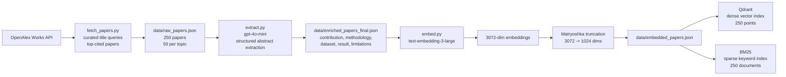

# Research Synthesis Engine

Research Synthesis Engine is a literature intelligence system for academic papers. It ingests top-cited research papers from OpenAlex, extracts structured metadata from abstracts, builds dense and sparse retrieval indexes, and prepares evidence-backed research briefs from user questions.

Users can choose a research area, pick a suggested question, or ask a free-text research question such as:

```text
What are the main approaches for reducing hallucinations in LLMs?
```

The final product output will be:

- Direct answer
- Research themes
- Evidence matrix
- Recommended reading path
- Open problems
- Optional timeline

## Project Status

**Phase 1: Ingestion & Indexing — Complete**  
**Phase 2: Live Hybrid Retrieval — In Progress**

The offline ingestion and indexing pipeline is implemented and validated. The first live retrieval wrapper is also available for free-text user questions.

```text
OpenAlex fetch
→ raw paper corpus
→ LLM metadata extraction
→ enriched paper corpus
→ OpenAI embeddings
→ Matryoshka truncation
→ Qdrant dense index
→ BM25 sparse index
```

## Ingestion Pipeline Architecture



## Dataset

The corpus contains 250 academic papers across 5 research areas:

| Research Area | Papers |
| --- | ---: |
| Retrieval-Augmented Generation (RAG) | 50 |
| Transformers / Attention Mechanisms | 50 |
| LLM Evaluation & Hallucination Detection | 50 |
| AI Agents & Tool Use | 50 |
| Fine-tuning (LoRA / PEFT) | 50 |

Papers are fetched from OpenAlex using curated title-query aliases, sorted toward highly cited works, deduplicated globally, and filtered to require a title and reconstructable abstract.

## Data Artifacts

| Artifact | Description |
| --- | --- |
| `data/raw_papers.json` | Raw OpenAlex paper metadata and abstracts |
| `data/enriched_papers_final.json` | LLM-extracted structured metadata |
| `data/embedded_papers.json` | 1024-dimensional truncated embeddings plus metadata |
| `data/bm25_index.pkl` | Local BM25 sparse retrieval index |
| Qdrant `research_papers` collection | Dense vector index with 250 points |

## Structured Metadata

Each enriched paper includes:

```text
title
abstract
authors
citation_count
year
topic
main_contribution
methodology
dataset_used
key_result
limitations
```

The extraction prompt uses `"not stated in abstract"` when a dataset, key result, or limitation is not stated in the abstract. Survey-style papers naturally contain more of these values because their abstracts summarize a field rather than report one specific experiment.

Example enriched record:

```json
{
  "title": "Attention Is All You Need",
  "topic": "Transformers / Attention Mechanisms",
  "citation_count": 6583,
  "year": 2025,
  "main_contribution": "Proposing the Transformer architecture based solely on attention mechanisms.",
  "methodology": "Experiments on machine translation tasks.",
  "dataset_used": "WMT 2014 English-to-German and English-to-French translation tasks.",
  "key_result": "Achieving state-of-the-art BLEU scores of 28.4 and 41.8 on respective tasks.",
  "limitations": "not stated in abstract"
}
```

## Retrieval Foundation

The project now has both retrieval indexes needed for hybrid search:

- **Dense retrieval:** Qdrant collection `research_papers`, 250 vectors, cosine distance, 1024 dimensions
- **Sparse retrieval:** BM25 index over the same 250-paper corpus
- **Hybrid retrieval:** `retrieval.hybrid_search` embeds a user question, searches Qdrant and BM25, merges duplicate papers, and returns ranked candidates with dense, sparse, and hybrid scores

Hybrid query example:

```bash
python -m retrieval.hybrid_search "What are the main approaches for reducing hallucinations in LLMs?" --final-top-k 5
```

Dense sanity query:

```text
hallucination detection in large language models
```

returned relevant papers from `LLM Evaluation & Hallucination Detection`, including hallucination surveys and detection methods.

BM25 sanity query returned relevant papers such as:

```text
A Survey on Hallucination in Large Language Models
SelfCheckGPT: Zero-Resource Black-Box Hallucination Detection
HaluEval: A Large-Scale Hallucination Evaluation Benchmark
```

## Validation

Current validated numbers:

```text
raw papers: 250
enriched papers: 250
embedded papers: 250
Qdrant points: 250
BM25 documents: 250
stored embedding dimensions: 1024
full embedding dimensions from OpenAI: 3072
tests: 22 passed
```

The validation counts above are generated from the local artifacts and indexing checks.

## Tech Stack

- Python
- OpenAlex API
- `gpt-4o-mini` for abstract extraction
- `text-embedding-3-large` for embeddings
- Qdrant for dense vector search
- BM25 via `rank-bm25` for sparse search
- Pydantic for schema validation
- Docker Compose for local Qdrant
- Pytest with mocked external API paths

## Local Setup

```bash
python -m venv .venv
source .venv/bin/activate
pip install -e ".[dev]"
cp .env.example .env
```

Required `.env` values for full rebuilds:

```bash
OPENAI_API_KEY=
QDRANT_URL=http://localhost:6333
OPENALEX_API_KEY=
OPENALEX_EMAIL=
```

## Rebuild Commands

Fetch papers:

```bash
python -m ingestion.fetch_papers --per-topic 50 --output data/raw_papers.json
```

Extract structured metadata:

```bash
python -m ingestion.extract --model gpt-4o-mini
```

Generate embeddings:

```bash
python -m ingestion.embed --model text-embedding-3-large --batch-size 32
```

Start Qdrant:

```bash
docker compose up -d qdrant
```

Index Qdrant:

```bash
python -m retrieval.index_qdrant
```

Build BM25:

```bash
python -m retrieval.build_bm25 --query "hallucination detection in large language models"
```

Dense search sanity check:

```bash
python -m retrieval.search_qdrant "hallucination detection in large language models"
```

Hybrid retrieval query:

```bash
python -m retrieval.hybrid_search "What are the main approaches for reducing hallucinations in LLMs?" --final-top-k 5
```

Run tests:

```bash
PYTEST_DISABLE_PLUGIN_AUTOLOAD=1 python -m pytest tests
```

## Next Phase

The next phase extends the retrieval pipeline:

```text
user question
→ query embedding
→ dense Qdrant search
→ BM25 sparse search
→ result fusion
→ local cross-encoder reranking
→ citation-aware scoring
→ CRAG confidence check
→ research brief / evidence matrix / reading path
```

## Design Principles

- Use real papers and real retrieval artifacts.
- Keep tests free of live external API calls.
- Prefer honest batch ingestion over unnecessary event streaming.
- Save intermediate artifacts so the pipeline is inspectable.
- Keep datasets, results, limitations, and metrics tied to source artifacts.
- Make the final output useful as a research decision-support tool, not just a summary.

