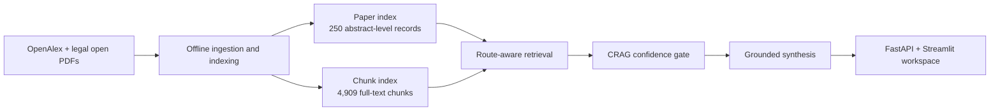
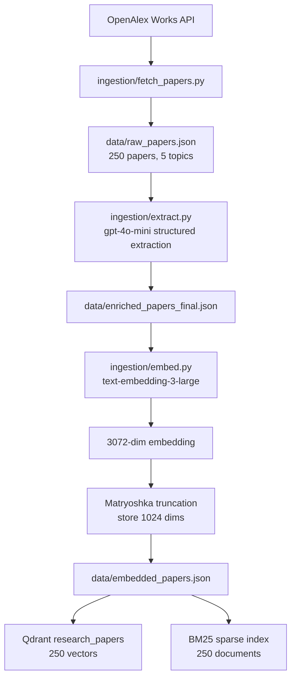
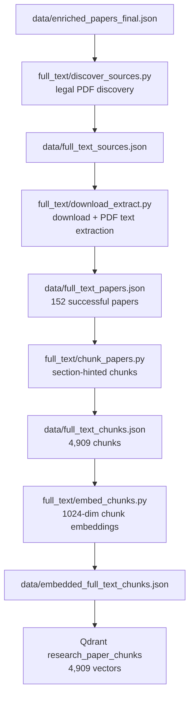
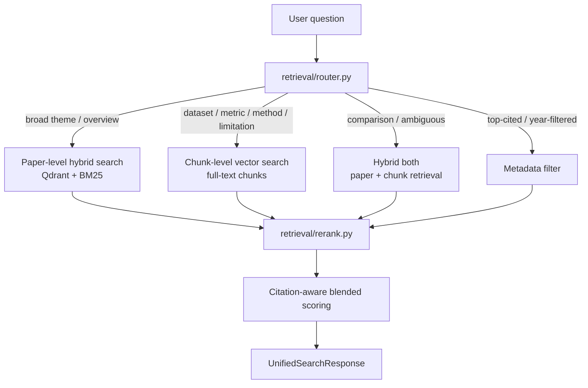
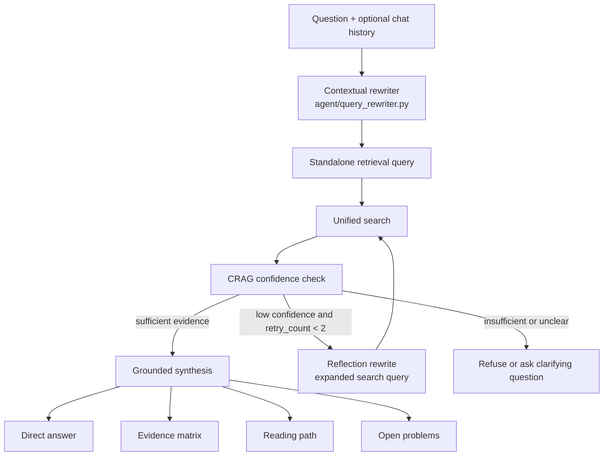
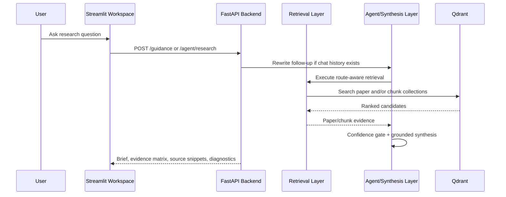

# Research Synthesis Engine

Research Synthesis Engine is a literature intelligence system for AI research papers. It builds a curated corpus, indexes both abstracts and full-text chunks, routes user questions to the right retrieval path, and returns grounded research briefs with evidence matrices, reading paths, open problems, and source snippets.

The project is designed around a practical research workflow: a user should be able to ask a question such as `What are the main approaches for reducing hallucinations in LLMs?` and receive a concise answer backed by retrieved papers, not a generic chatbot response.

## Current Snapshot

| Area | Current State |
| --- | ---: |
| Research areas | 5 |
| Paper-level corpus | 250 papers |
| Full-text papers extracted | 152 papers |
| Full-text chunks indexed | 4,909 chunks |
| Paper-level Qdrant points | 250 |
| Chunk-level Qdrant points | 4,909 |
| Evaluation queries | 35 |
| Queries with exact relevant-ID labels | 22 |
| Test suite | 237 passing tests |
| Fast-first guidance latency | 21.3s -> 8.8s on the demo benchmark |

## What The System Returns

The Streamlit workspace produces an analyst-style research brief:

- A confidence-gated direct answer
- Research themes
- Evidence matrix with claims, methods, datasets, results, limitations, and source IDs
- Recommended reading path
- Open problems grounded in retrieved evidence
- Source snippets and optional diagnostics
- Follow-up handling through context-aware query rewriting

## Architecture Overview



The system has two separate phases: an offline pipeline that builds trusted local artifacts, and a live pipeline that answers questions from those artifacts.

## Offline Ingestion Pipeline



The abstract-level index covers every paper in the corpus. It supports broad discovery questions, topic comparisons, reading recommendations, and metadata-style queries.

## Full-Text Expansion Pipeline



Full-text retrieval is used for questions that need details from the body of papers: datasets, metrics, experiments, method differences, reported results, and limitations. Papers without legal full text still remain available through abstract-level retrieval.

## Live Retrieval Pipeline



The router keeps broad paper discovery separate from detailed full-text evidence. Ambiguous questions default to `hybrid_both` so the system does not prematurely choose the wrong retrieval granularity.

## Agentic Synthesis Pipeline



This is implemented as a bounded Python state loop in `agent/research_graph.py`. It provides the agentic behavior the project needs: context rewriting, retrieval, confidence assessment, limited retry, and traceable synthesis without requiring a heavyweight orchestration framework.

## API And UI Flow



The default UI path uses `/guidance` for the polished research brief. `/agent/research` is available for traceable agent-loop diagnostics.

## Data Artifacts

| Artifact | Description |
| --- | --- |
| `data/raw_papers.json` | Raw OpenAlex paper metadata and abstracts |
| `data/enriched_papers_final.json` | LLM-extracted structured metadata |
| `data/embedded_papers.json` | 1024-dimensional truncated paper embeddings |
| `data/bm25_index.pkl` | Local BM25 sparse retrieval index |
| `data/full_text_sources.json` | Discovered legal open full-text PDF sources |
| `data/full_text_papers.json` | Download and extraction results for available PDFs |
| `data/full_text_chunks.json` | Section-hinted full-text chunks |
| `data/embedded_full_text_chunks.json` | 1024-dimensional full-text chunk embeddings |
| `data/pdfs/` | Local downloaded PDF files |
| Qdrant `research_papers` | Dense paper-level vector index |
| Qdrant `research_paper_chunks` | Dense full-text chunk vector index |

## Corpus

| Research Area | Papers | Extracted Full Text Papers |
| --- | ---: | ---: |
| Retrieval-Augmented Generation (RAG) | 50 | 35 |
| Transformers / Attention Mechanisms | 50 | 25 |
| LLM Evaluation & Hallucination Detection | 50 | 33 |
| AI Agents & Tool Use | 50 | 30 |
| Fine-tuning (LoRA / PEFT) | 50 | 29 |

Papers are fetched from OpenAlex using curated title-query aliases, ranked toward highly cited work, deduplicated globally, and filtered to require a title and reconstructable abstract.

## Structured Metadata

Each enriched paper includes:

```text
title
abstract
authors
citation_count
year
topic
main_contribution
methodology
dataset_used
key_result
limitations
```

The extraction prompt uses `"not stated in abstract"` when a dataset, key result, or limitation is not stated in the abstract. Survey-style papers naturally contain more of these values because their abstracts summarize a field rather than report one specific experiment.

Example enriched record:

```json
{
  "title": "Attention Is All You Need",
  "topic": "Transformers / Attention Mechanisms",
  "citation_count": 6583,
  "year": 2025,
  "main_contribution": "Proposing the Transformer architecture based solely on attention mechanisms.",
  "methodology": "Experiments on machine translation tasks.",
  "dataset_used": "WMT 2014 English-to-German and English-to-French translation tasks.",
  "key_result": "Achieving state-of-the-art BLEU scores of 28.4 and 41.8 on respective tasks.",
  "limitations": "not stated in abstract"
}
```

## Evaluation Strategy

The evaluation fixture is intentionally mixed: some queries have exact relevant IDs for Recall/MRR, while others test routing, topic coverage, keyword presence, contextual rewriting, and confidence-gated refusal.

| Evaluation Focus | Query Count | What It Checks |
| --- | ---: | --- |
| Full-text evidence | 12 | Dataset, metric, method, result, and limitation questions that should use chunks |
| Cross-topic comparison | 6 | Questions that should combine paper-level and chunk-level evidence |
| Confidence gate | 5 | Out-of-corpus or under-specified questions that should not hallucinate |
| Metadata filter | 4 | Top-cited and year-filtered questions |
| Contextual rewrite | 4 | Follow-up questions that require chat history |
| Route selection | 3 | Broad overview questions |
| Reading path | 1 | Reading recommendation behavior |

Current evaluation fixture:

```text
queries: 35
queries_with_relevant_ids: 22
multi_turn_queries: 4
out_of_corpus_queries: 3
weak_evidence_queries: 2
```

Run the evaluation after starting Qdrant:

```bash
python -m retrieval.evaluate --queries tests/fixtures/eval_queries.json
```

The runner reports route accuracy, topic hit rate, keyword hit rate, Recall@5, Recall@10, MRR, rewrite keyword hit rate, confidence decision accuracy, and CRAG fallback success rate. Recall and MRR are computed only over the subset with exact relevant-ID labels.

Latest local run on the 35-query fixture:

| Metric | Value | Scope |
| --- | ---: | --- |
| Route accuracy | 0.71 | all queries |
| Topic hit rate@10 | 1.00 | topic-labeled queries |
| Keyword hit rate@10 | 0.94 | keyword-labeled queries |
| Recall@10 | 0.73 | 22 exact-ID labeled queries |
| MRR | 0.57 | 22 exact-ID labeled queries |
| Rewrite keyword hit rate | 1.00 | 4 contextual queries |
| Confidence decision accuracy | 0.80 | 5 confidence-labeled queries |
| CRAG fallback success rate | 0.80 | 5 expected fallback queries |

A detailed metric policy and fixture breakdown lives in `docs/EVALUATION.md`.

## Performance Note

The UI was changed to return the direct answer and evidence matrix first, then generate heavier sections on demand. On the hallucination demo question, this reduced the first `/guidance` response from about 21.3 seconds to about 8.8 seconds.

| Mode | Initial Response |
| --- | ---: |
| Full guidance in one call | 21.3s |
| Fast-first guidance | 8.8s |

## Validation

```text
raw papers: 250
enriched papers: 250
embedded papers: 250
paper-level Qdrant points: 250
BM25 documents: 250
full-text papers: 152
full-text chunks: 4909
chunk-level Qdrant points: 4909
stored embedding dimensions: 1024
full embedding dimensions from OpenAI: 3072
tests: 237 passed
```

These counts reflect the current local artifacts, index checks, and test suite.

## Tech Stack

- Python
- OpenAlex API
- `gpt-4o-mini` for abstract extraction
- `text-embedding-3-large` for embeddings
- Qdrant for dense vector search
- BM25 via `rank-bm25` for sparse search
- Pydantic for schema validation
- Docker Compose for local Qdrant
- FastAPI for the backend service
- Streamlit for the research analyst workspace
- Pytest with mocked external API paths

## Local Setup

```bash
python -m venv .venv
source .venv/bin/activate
pip install -e ".[dev]"
cp .env.example .env
```

Required `.env` values for full rebuilds:

```bash
OPENAI_API_KEY=
QDRANT_URL=http://localhost:6333
OPENALEX_API_KEY=
OPENALEX_EMAIL=
RSE_CORS_ORIGINS=http://localhost:8501,http://127.0.0.1:8501
RSE_API_URL=http://localhost:8000
```

## Rebuild Commands

Fetch papers:

```bash
python -m ingestion.fetch_papers --per-topic 50 --output data/raw_papers.json
```

Extract structured metadata:

```bash
python -m ingestion.extract --model gpt-4o-mini
```

Generate embeddings:

```bash
python -m ingestion.embed --model text-embedding-3-large --batch-size 32
```

Start Qdrant:

```bash
docker compose up -d qdrant
```

Index Qdrant:

```bash
python -m retrieval.index_qdrant
```

Build BM25:

```bash
python -m retrieval.build_bm25 --query "hallucination detection in large language models"
```

Dense search sanity check:

```bash
python -m retrieval.search_qdrant "hallucination detection in large language models"
```

Hybrid retrieval query:

```bash
python -m retrieval.hybrid_search "What are the main approaches for reducing hallucinations in LLMs?" --final-top-k 5
```

Tool-style JSON retrieval:

```bash
python -m tools.research_retrieval "What are the main approaches for reducing hallucinations in LLMs?" --top-k 5
```

Route-aware unified retrieval:

```bash
python -m retrieval.unified_search "Which datasets and metrics are used to evaluate hallucination detection?" --top-k 5
```

Discover open full-text sources:

```bash
python -m full_text.discover_sources --input data/enriched_papers_final.json --output data/full_text_sources.json
```

Select the full-text subset:

```bash
python -m full_text.select_sources --input data/full_text_sources.json --output data/full_text_selected.json --per-topic 25
```

Download and extract full-text PDFs:

```bash
python -m full_text.download_extract --input data/full_text_selected_all.json --output data/full_text_papers.json --pdf-dir data/pdfs --append-existing
```

Recover additional legal PDFs for abstract-only papers when more open sources are discovered:

```bash
python -m full_text.recover_sources --existing-papers data/full_text_papers.json --existing-chunks data/full_text_chunks.json --output data/full_text_papers.json --pdf-dir data/pdfs
```

Chunk extracted full text:

```bash
python -m full_text.chunk_papers --input data/full_text_papers.json --output data/full_text_chunks.json --max-words 450 --overlap-words 75
```

Embed full-text chunks:

```bash
python -m full_text.embed_chunks --input data/full_text_chunks.json --output data/embedded_full_text_chunks.json --batch-size 64 --dimensions 1024
```

Index full-text chunks in Qdrant:

```bash
python -m full_text.index_chunks_qdrant --input data/embedded_full_text_chunks.json --collection research_paper_chunks
```

Run tests:

```bash
PYTEST_DISABLE_PLUGIN_AUTOLOAD=1 python -m pytest tests
```

Benchmark demo latency after starting the API:

```bash
python -m tools.benchmark_latency --endpoint /guidance --endpoint /agent/research --fast-first
```

Run retrieval evaluation:

```bash
python -m retrieval.evaluate --queries tests/fixtures/eval_queries.json
```

Assess retrieval confidence from a saved unified response:

```bash
python -m retrieval.confidence --input path/to/unified_response.json
```

Generate a CRAG-gated research brief from a saved unified response:

```bash
python -m agent.synthesis --input path/to/unified_response.json
```

Generate an evidence matrix as Markdown:

```bash
python -m agent.evidence_matrix --input path/to/unified_response.json --markdown
```

Generate a grounded reading path:

```bash
python -m agent.reading_path --query "Which LoRA and PEFT papers should I read first?"
```

Generate grounded open problems:

```bash
python -m agent.open_problems --query "What are unresolved problems in hallucination detection?"
```

Generate combined research guidance from one retrieval response:

```bash
python -m agent.research_guidance --query "Compare RAG and self-verification methods."
```

Start the FastAPI backend:

```bash
uvicorn api.main:app --reload
```

Start the Streamlit analyst workspace:

```bash
RSE_API_URL=http://localhost:8000 streamlit run ui/streamlit_app.py
```

The workspace keeps controls in the sidebar: research area, publication year range, evidence depth, full-text evidence mode, diagnostics, and conversation memory. The main page focuses on the suggested question, the free-text question box, route preview, and analysis run. During analysis, the UI shows a concise retrieval/synthesis status before navigating to the results page. The first result prioritizes the direct answer and evidence matrix; reading path and open problems are generated on demand from their tabs.


Call the main API endpoint:

```bash
curl -X POST http://localhost:8000/guidance \
  -H "Content-Type: application/json" \
  -H "X-Request-ID: demo-request-001" \
  -d '{"question":"Compare RAG and self-verification methods.","top_k":5,"include_debug":false}'
```

API endpoints:

```text
GET  /health
GET  /corpus/stats
POST /route
POST /retrieve
POST /confidence
POST /brief
POST /evidence-matrix
POST /reading-path
POST /open-problems
POST /guidance
POST /agent/research
```

API request notes:

```text
question: canonical public field for user questions
query: accepted as a backward-compatible alias
research_areas: optional list of supported corpus topics
publication_year_min / publication_year_max: optional post-retrieval year filters
full_text_only: keeps chunk-level evidence and omits abstract-only paper rows
include_debug: returns route signals, confidence signals, score breakdowns, and timing metrics
chat_history: optional prior user/assistant turns used to rewrite contextual follow-up questions into standalone retrieval queries
```

Structured API errors include an `error.code`, message, details, and `request_id`. Every response includes an `X-Request-ID` header; callers may provide one or let the API generate a UUID.

CORS is configured by `RSE_CORS_ORIGINS` as a comma-separated origin list. The default supports local Streamlit development on `http://localhost:8501` and `http://127.0.0.1:8501` without using a wildcard.

## Guidance Output

Reading paths use deterministic candidate selection first, then the language model writes grounded explanations for valid retrieved IDs only. The stages are:

```text
foundational
core_methods
evaluation_and_benchmarks
recent_advances
limitations_and_open_problems
```

Open-problems reports are limited to retrieved evidence. They use extracted limitations, limitation/future-work chunks, evaluation gaps, conflicts, and corpus limitations; unsupported problems are rejected during validation.

Example guidance shape:

```json
{
  "question": "Which papers should I read first?",
  "reading_path": {
    "total_papers": 5,
    "confidence_decision": "sufficient_evidence"
  },
  "open_problems": {
    "problems": [
      {
        "title": "Benchmark coverage remains limited",
        "evidence_strength": "moderate",
        "supporting_source_ids": ["paper:..."]
      }
    ]
  }
}
```

Known limits: recommendations are limited to the current five-topic corpus, the reading path is not an exhaustive literature survey, and missing full text can reduce limitation/open-problem coverage.

## Demo Flow

The current end-to-end workflow is:

```text
user question + optional chat history
→ Streamlit workspace
→ standalone query rewrite
→ optional route preview
→ FastAPI /guidance or /agent/research graph loop
→ paper retrieval / chunk retrieval / metadata filter
→ local cross-encoder reranking
→ citation-aware scoring
→ CRAG confidence check
→ confidence-gated answer
→ evidence matrix, reading path, open problems, and source inspection
```

A short demo script with recommended questions is available in `docs/DEMO_SCRIPT.md`.

## Design Principles

- Use real papers and real retrieval artifacts.
- Keep tests free of live external API calls.
- Prefer honest batch ingestion over unnecessary event streaming.
- Save intermediate artifacts so the pipeline is inspectable.
- Keep datasets, results, limitations, and metrics tied to source artifacts.
- Make the final output useful as a research decision-support tool, not just a summary.

