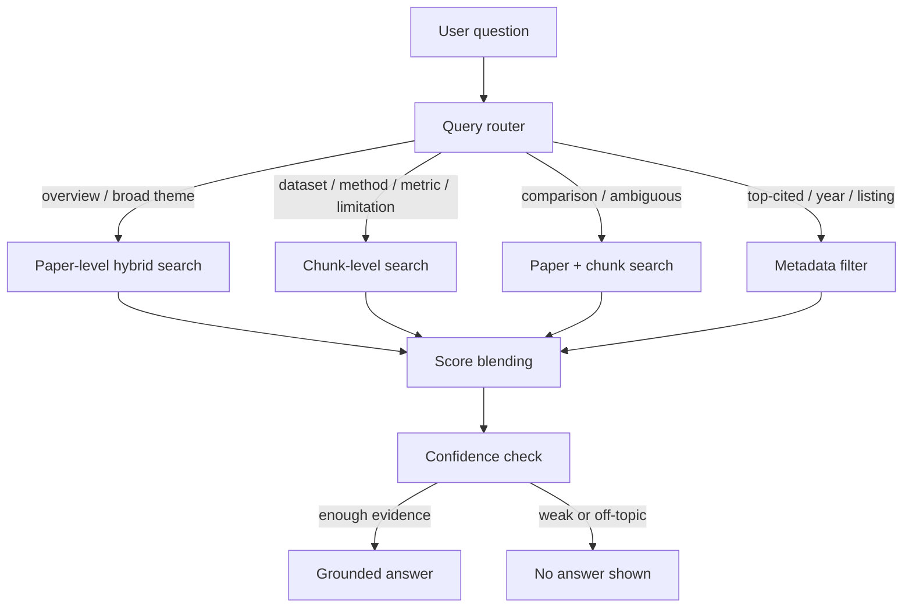

# Research Synthesis Engine

A retrieval-augmented research assistant for AI papers. It routes each question to paper-level metadata, full-text chunks, or both, checks whether the retrieved evidence is sufficient before generating an answer, and declines to answer when it isn't.

**Live app:** [research-synthesis-engine.streamlit.app](https://research-synthesis-engine-auf9fawskhzarpqdv3sn2q.streamlit.app/)  
**API:** [research-synthesis-engine-api.onrender.com](https://research-synthesis-engine-api.onrender.com)

*(Free-tier hosting: the API spins down after ~15 minutes of inactivity, so the first request after a while may take 30-60s.)*

## Results

| Metric | Value | Scope |
| --- | ---: | --- |
| Route accuracy | 1.00 | 50 queries |
| Confidence decision accuracy | 1.00 | 6 confidence-labeled queries |
| Relevant-ID hit rate@10 | 1.00 | 36 exact-ID labeled queries |
| Recall@10 | 0.76 | 36 exact-ID labeled queries |
| MRR | 0.75 | 36 exact-ID labeled queries |
| Initial response latency | 21.3s to 8.8s | fast-first response redesign |

Full methodology in [`docs/EVALUATION.md`](docs/EVALUATION.md).

## What It Does

Example questions the system supports:

- `What are the main approaches for reducing hallucinations in LLMs?`
- `Compare LoRA and BitFit for parameter-efficient fine-tuning.`
- `Show me highly cited AI agent survey papers published after 2023.`
- `Explain the BitFit paper.`
- `What datasets are used to evaluate LoRA fine-tuning?`

If retrieved evidence is weak or outside the corpus, it shows the closest sources and doesn't generate an answer:

```text
Question: What does this system know about marine biology and coral bleaching?
Decision: insufficient_evidence
Result: no grounded answer shown
```

## Current Corpus

| Item | Count |
| --- | ---: |
| Research areas | 5 |
| Papers | 250 |
| Papers with extracted full text | 152 |
| Full-text chunks | 4,909 |
| Evaluation queries | 50 |
| Test suite | 303 passing tests |

Research areas: Retrieval-Augmented Generation (RAG), Transformers / Attention Mechanisms, LLM Evaluation & Hallucination Detection, AI Agents & Tool Use, Fine-tuning (LoRA / PEFT)

## Architecture

Two parts: an offline pipeline that builds the corpus, extracts metadata, embeds, and indexes into Qdrant; and a live pipeline that routes questions, retrieves evidence, checks confidence, and generates the answer.


```mermaid
flowchart TD
    A["User question"] --> B["Query router"]
    B -->|"overview / broad theme"| C["Paper-level hybrid search"]
    B -->|"dataset / method / metric / limitation"| D["Chunk-level search"]
    B -->|"comparison / ambiguous"| E["Paper + chunk search"]
    B -->|"top-cited / year / listing"| F["Metadata filter"]
    C --> G["Score blending"]
    D --> G
    E --> G
    F --> G
    G --> H["Confidence check"]
    H -->|"enough evidence"| I["Grounded answer"]
    H -->|"weak or off-topic"| J["No answer shown"]
```

## Design Notes

- Hybrid BM25 + dense retrieval, not dense-only: keyword-heavy queries (paper titles, method names) retrieve more reliably with BM25 in the mix.
- The confidence gate is conservative: declining to answer is preferred over a fluent but ungrounded answer.
- Cross-encoder reranking is disabled in the deployed version (`RSE_APPLY_RERANKING=false`) to stay inside Render's free-tier memory limit; it's available locally.
- The UI returns the direct answer and evidence matrix before heavier sections (reading path, open problems), which cut initial latency from ~21.3s to ~8.8s.

## Tech Stack

Qdrant, BM25 (`rank-bm25`), cross-encoder reranking (opt-in), OpenAI `gpt-4o-mini` and `text-embedding-3-large`, FastAPI, Streamlit, Pydantic, Docker, Pytest (303 tests with mocked external calls), Render, Streamlit Community Cloud, Qdrant Cloud.

## Local Setup

```bash
python -m venv .venv
source .venv/bin/activate
pip install -e ".[dev]"
cp .env.example .env
```

Required `.env` values:

```bash
OPENAI_API_KEY=
QDRANT_URL=http://localhost:6333
QDRANT_API_KEY=
OPENALEX_API_KEY=
OPENALEX_EMAIL=
RSE_API_URL=http://localhost:8000
RSE_CORS_ORIGINS=http://localhost:8501,http://127.0.0.1:8501
RSE_APPLY_RERANKING=false
```

```bash
docker compose up -d qdrant
uvicorn api.main:app --reload
RSE_API_URL=http://localhost:8000 streamlit run ui/streamlit_app.py
```

## Main Commands

```bash
# Ingestion
python -m ingestion.fetch_papers --per-topic 50 --output data/raw_papers.json
python -m ingestion.extract --model gpt-4o-mini
python -m ingestion.embed --model text-embedding-3-large --batch-size 32
python -m retrieval.index_qdrant
python -m retrieval.build_bm25

# Full text
python -m full_text.discover_sources --input data/enriched_papers_final.json --output data/full_text_sources.json
python -m full_text.download_extract --input data/full_text_selected_all.json --output data/full_text_papers.json --pdf-dir data/pdfs --append-existing
python -m full_text.chunk_papers --input data/full_text_papers.json --output data/full_text_chunks.json --max-words 450 --overlap-words 75
python -m full_text.embed_chunks --input data/full_text_chunks.json --output data/embedded_full_text_chunks.json --batch-size 64 --dimensions 1024
python -m full_text.index_chunks_qdrant --input data/embedded_full_text_chunks.json --collection research_paper_chunks

# Evaluation and tests
python -m retrieval.evaluate --queries tests/fixtures/eval_queries.json
python -m pytest tests/ -q
```

## API

```text
GET  /health
GET  /corpus/stats
POST /route
POST /retrieve
POST /confidence
POST /brief
POST /evidence-matrix
POST /reading-path
POST /open-problems
POST /guidance
POST /agent/research
```

```bash
curl -X POST http://localhost:8000/guidance \
  -H "Content-Type: application/json" \
  -d '{"question":"Compare LoRA and BitFit for parameter-efficient fine-tuning.","top_k":8}'
```

`question` accepts `query` as a backward-compatible alias. Optional fields: `research_areas`, `publication_year_min`/`max`, `full_text_only`, `include_debug`, `chat_history`.

## Deployment

```text
Qdrant Cloud       vector database
Render             FastAPI backend (Docker runtime, health check at /health)
Streamlit Cloud    UI
```

Render env vars: `OPENAI_API_KEY`, `QDRANT_URL`, `QDRANT_API_KEY`, `RSE_APPLY_RERANKING=false`, `RSE_CORS_ORIGINS`.
Streamlit Cloud env var: `RSE_API_URL` pointing at the Render URL.

## Repository Layout

```text
ingestion/     OpenAlex ingestion, extraction, paper embeddings
full_text/     PDF discovery, extraction, chunking, chunk embeddings
retrieval/     Qdrant indexing, BM25, routing, unified search, evaluation
agent/         query rewriting, confidence-gated synthesis, evidence outputs
api/           FastAPI service
ui/            Streamlit app and UI API client
shared/        Pydantic schemas
tools/         command-line helpers and benchmarks
tests/         unit and integration tests with mocked external calls
docs/          decisions log, evaluation notes, demo script
```
