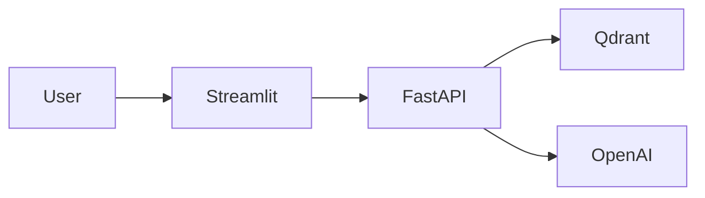
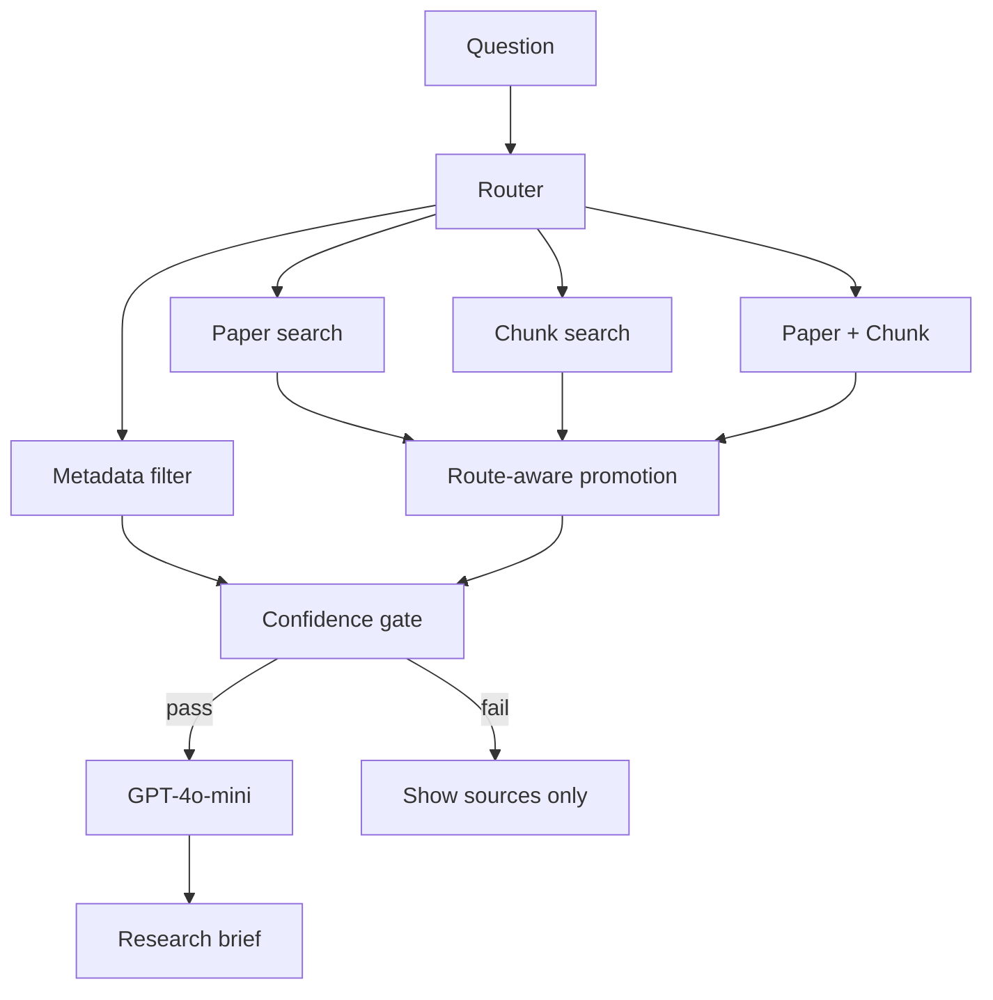
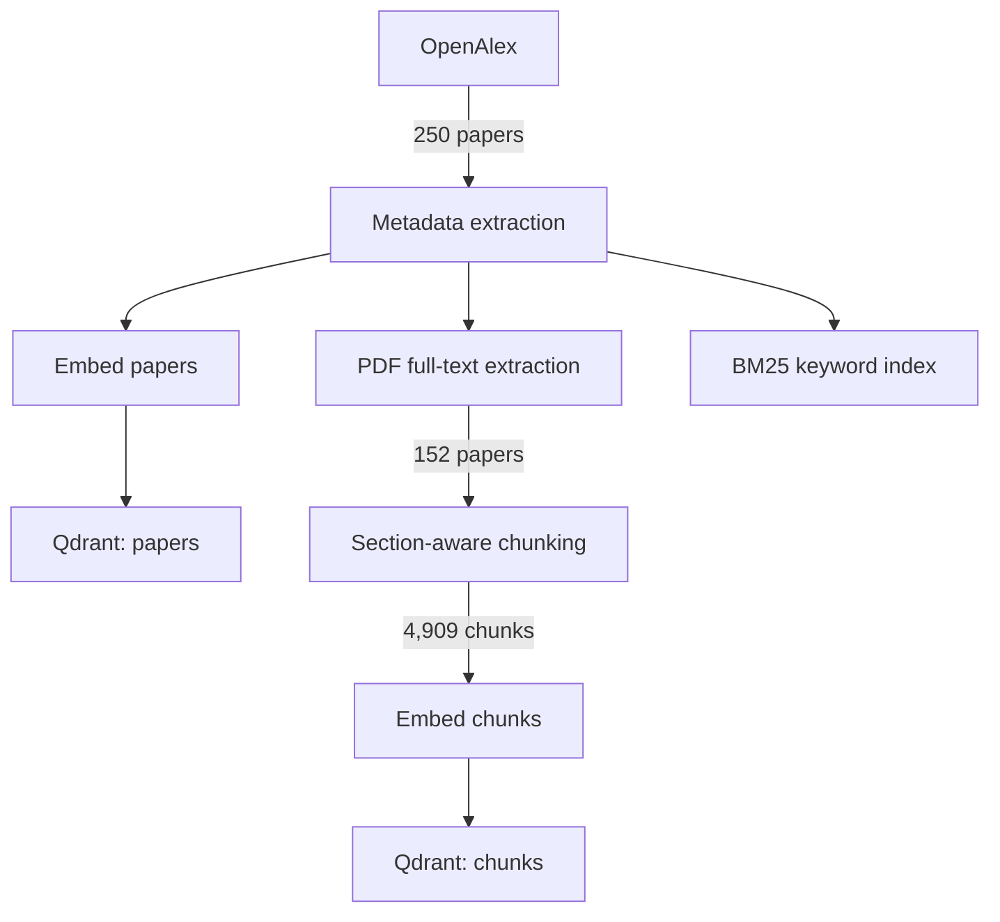
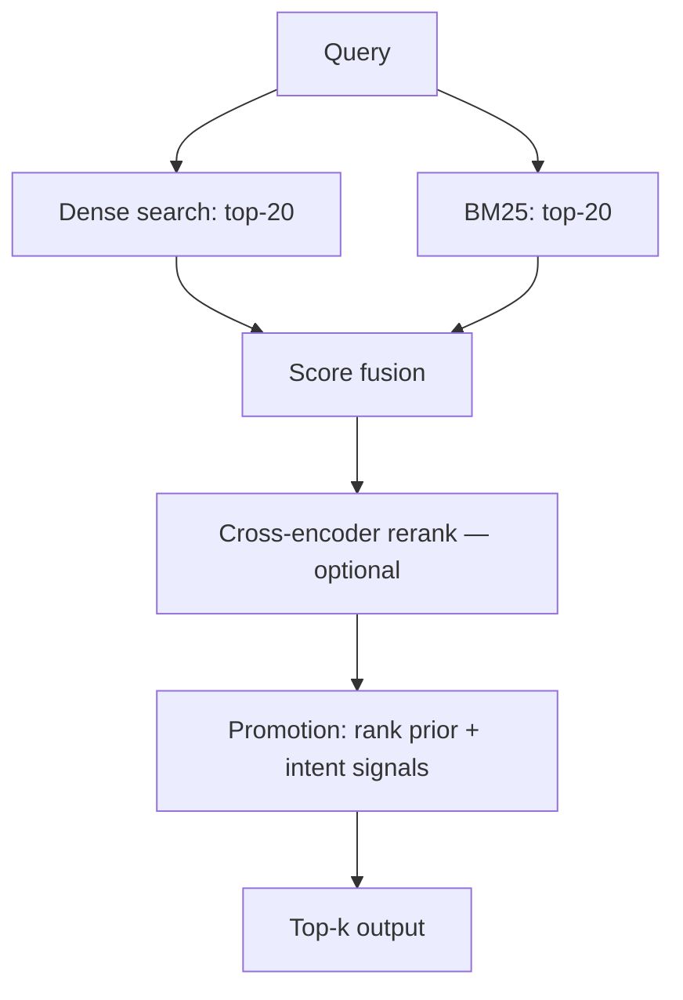

# Research Synthesis Engine

A retrieval-augmented research assistant that answers questions over a curated corpus of 250 AI research papers. It combines hybrid search (dense vectors + BM25), intent-aware query routing, and a confidence gate that refuses to answer when evidence is insufficient — preventing the hallucinated citations that general-purpose LLMs produce.

The current benchmark is an audited 250-query fixture with 233 exact-ID labeled queries. On the same fixture, the best tested chunking strategy (v2) reaches hit@10 0.738, Recall@10 0.577, and MRR 0.550. Deployed end-to-end on free-tier infrastructure (Render, Streamlit Cloud, Qdrant Cloud).

**Try it:** [streamlit app](https://research-synthesis-engine-auf9fawskhzarpqdv3sn2q.streamlit.app/) · [API](https://research-synthesis-engine-api.onrender.com)

Free-tier hosting — first request after inactivity takes 30–60s to cold-start.

---

## Screenshots


---

## What It Does

1. **Routes** the query to one of four retrieval paths based on what the question needs.
2. **Retrieves** candidates using hybrid search — dense embeddings + BM25.
3. **Promotes** intent-matched candidates using route-aware signals (section hints, vocabulary match, citation weight).
4. **Gates** the answer — if evidence is weak or off-topic, declines to answer.
5. **Synthesizes** a grounded brief with per-claim source attribution.

Example questions:
- `What datasets are used to evaluate hallucination detection methods?`
- `Compare RAG and fine-tuning as ways to inject domain knowledge.`
- `Show me highly cited AI agent survey papers published after 2023.`
- `How much does LoRA reduce GPU memory during fine-tuning?`

If the corpus can't support an answer:
```
Question: What does this system know about marine biology and coral bleaching?
Decision: insufficient_evidence — no answer generated
```

---

## Results

The current comparison uses 250 queries: 233 have exact expected IDs (specific chunks/papers that should appear), and 17 are topic/keyword-only behavior checks. The three chunking versions were evaluated against the same audited fixture.

| Metric | v1 | v2 (best) | v3 |
| --- | ---: | ---: | ---: |
| Route accuracy | 0.196 | 0.196 | 0.196 |
| Relevant-ID hit@10 | 0.742 | 0.738 | 0.730 |
| Recall@10 | 0.577 | 0.577 | 0.567 |
| MRR | 0.526 | **0.550** | 0.536 |
| Confidence accuracy | 0.647 | 0.647 | 0.647 |

The v2 result is the current selection because it has the best MRR and Recall@5. v3 performed worse than v1 on the audited fixture, so semantic chunking is not treated as an improvement by default.

Recall is strict: each query expects 3–4 specific IDs. Retrieving 2 of 3 is recall = 0.67, not 1.0.

Cross-encoder reranking is available locally but disabled in production — Render free tier doesn't have the memory for the model.

---

## Architecture

### System Overview


```mermaid
flowchart LR
    User --> Streamlit
    Streamlit --> FastAPI
    FastAPI --> Qdrant
    FastAPI --> OpenAI
```

### Query Pipeline


```mermaid
flowchart TD
    Question --> Router
    Router --> Paper[Paper search]
    Router --> Chunk[Chunk search]
    Router --> Hybrid[Paper + Chunk]
    Router --> Metadata[Metadata filter]

    Paper --> Promotion[Route-aware promotion]
    Chunk --> Promotion
    Hybrid --> Promotion
    Metadata --> Gate

    Promotion --> Gate[Confidence gate]
    Gate -->|pass| Synthesis[GPT-4o-mini]
    Gate -->|fail| Decline[Show sources only]
    Synthesis --> Brief[Research brief]
```

### Ingestion Pipeline


```mermaid
flowchart TD
    OpenAlex -->|250 papers| Extraction[Metadata extraction]
    Extraction --> Embedding[Embed papers]
    Embedding --> QdrantPapers[Qdrant: papers]

    Extraction --> PDFs[PDF full-text extraction]
    PDFs -->|152 papers| Chunking[Section-aware chunking]
    Chunking -->|4,909 chunks| EmbedChunks[Embed chunks]
    EmbedChunks --> QdrantChunks[Qdrant: chunks]

    Extraction --> BM25[BM25 keyword index]
```

### Retrieval Detail

Paper-level retrieval fuses dense Qdrant search with BM25. Full-text chunk
retrieval currently uses dense Qdrant search; the system is hybrid across its
paper and chunk paths, but it does not yet maintain a separate sparse chunk
index.


```mermaid
flowchart TD
    Query --> Dense[Dense search: top-20]
    Query --> Sparse[BM25: top-20]
    Dense --> Fusion[Score fusion]
    Sparse --> Fusion
    Fusion --> Rerank[Cross-encoder rerank — optional]
    Rerank --> Promote[Promotion: rank prior + intent signals]
    Promote --> TopK[Top-k output]
```

---

## Corpus

| Item | Count |
| --- | ---: |
| Research areas | 5 |
| Papers indexed | 250 |
| Papers with full text | 152 |
| Full-text chunks | 4,909 |
| Evaluation queries | 250 audited |
| Exact-ID labeled | 233 |
| Core tests | 362 test functions (Python >=3.11) |

Research areas: Retrieval-Augmented Generation, Transformers & Attention, LLM Evaluation & Hallucination Detection, AI Agents & Tool Use, Fine-tuning (LoRA / PEFT)

---

## Tech Stack

| Layer | Tools |
| --- | --- |
| Retrieval | Qdrant, OpenAI `text-embedding-3-large` (1024d), BM25, weighted/RRF fusion |
| Ranking | Citation-aware scoring, route-aware promotion, optional cross-encoder (`ms-marco-MiniLM-L-6-v2`) |
| Synthesis | GPT-4o-mini, query router, query rewriter, CRAG-style confidence gate |
| Data pipeline | OpenAlex API, `pypdf`, Pydantic, section-aware chunking |
| Backend | FastAPI, structured errors, request-ID tracing, TTL cache |
| Frontend | Streamlit (streaming, evidence matrix, reading path) |
| Evaluation | Audited 250-query fixture, hit@k, recall@k, MRR, confidence accuracy, faithfulness judge |
| Deployment | Render (Docker), Streamlit Community Cloud, Qdrant Cloud — all free tier |

---

## Design Decisions

- **Hybrid search over dense-only:** keyword-heavy queries (paper titles, method names) need BM25.
- **Confidence gate is conservative:** declining to answer is preferred over hallucinating.
- **Cross-encoder disabled in production:** Render free tier = 512MB. The model alone needs ~512MB. Fallback preserves retrieval order.
- **MMR disabled by default:** measured it, hurt recall (0.65 → 0.62 at k=5). Most queries want depth in one paper, not diversity.
- **Pool-invariant promotion:** bonuses depend only on a candidate's own rank and payload. Widening the pool can't rescale existing candidates.

---

## Local Setup

```bash
python3.11 -m venv .venv && source .venv/bin/activate
pip install -e ".[dev]"
cp .env.example .env
```

Required `.env`:
```
OPENAI_API_KEY=
QDRANT_URL=http://localhost:6333
QDRANT_API_KEY=
RSE_APPLY_RERANKING=false
```

Run:
```bash
docker compose up -d qdrant
uvicorn api.main:app --reload
streamlit run ui/streamlit_app.py
```

Evaluate:
```bash
python -m retrieval.evaluate --queries tests/fixtures/eval_queries_250_audited.json --qdrant-url http://localhost:6333
python -m pytest tests/ -q
```

When indexing locally, pass the same endpoint explicitly so a Cloud URL in a
different `.env` cannot silently receive the new vectors:

```bash
python retrieval/index_qdrant.py --qdrant-url http://localhost:6333
python full_text/index_chunks_qdrant.py --qdrant-url http://localhost:6333
```

Optional — local cross-encoder:
```bash
pip install -r requirements-rerank.txt
# omit --no-rerank to enable (on by default when torch is installed)
```

---

## API

```
GET  /health              Health check
GET  /corpus/stats        Corpus statistics
POST /route               Route preview
POST /retrieve            Retrieval results
POST /confidence          Confidence check
POST /brief               Research brief
POST /evidence-matrix     Claim-level attribution
POST /reading-path        Paper recommendations
POST /open-problems       Research gaps
POST /guidance            Guided session
POST /agent/research      Multi-step research agent
```

---

## Deployment

| Service | Role |
| --- | --- |
| Qdrant Cloud | Vector database (free 1GB) |
| Render | FastAPI backend (Docker, health check at `/health`) |
| Streamlit Cloud | UI (`RSE_API_URL` → Render) |

Env vars for Render: `OPENAI_API_KEY`, `QDRANT_URL`, `QDRANT_API_KEY`, `RSE_APPLY_RERANKING=false`, `RSE_CORS_ORIGINS`.

---

## Limitations

- Recall@10 is 0.39 — most missing evidence is below the top-10 cutoff (ranking problem, not retrieval problem).
- Static corpus, no incremental updates.
- Synthesis depends on GPT-4o-mini.
- Free-tier cold starts: 30–60s.

---

## Repository Layout

```
ingestion/     Paper collection, metadata extraction, embeddings
full_text/     PDF discovery, text extraction, chunking, chunk embeddings
retrieval/     Indexing, BM25, routing, hybrid search, promotion, evaluation
agent/         Query rewriting, confidence gate, synthesis, evidence outputs
api/           FastAPI service
ui/            Streamlit app
shared/        Pydantic schemas
tests/         351 tests (mocked external dependencies)
docs/          Decision log, evaluation methodology, failure analysis
```
