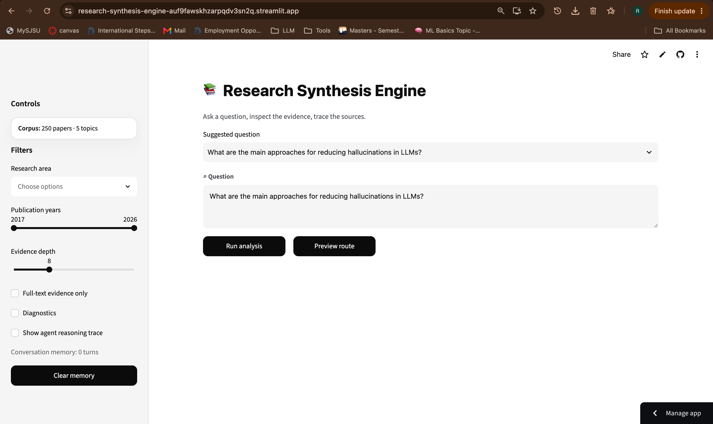
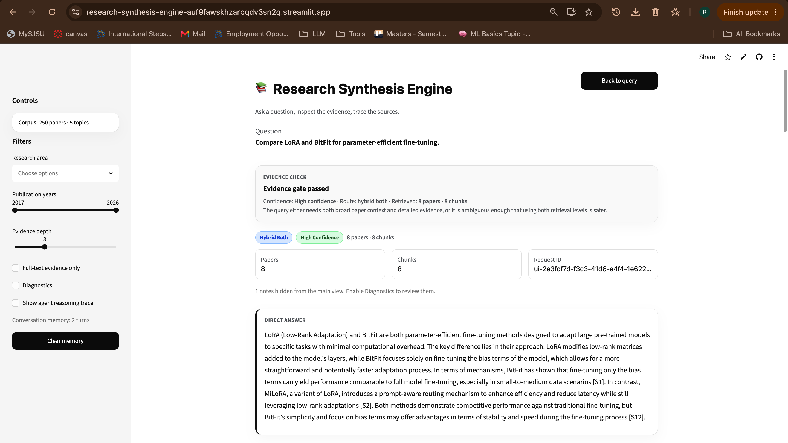
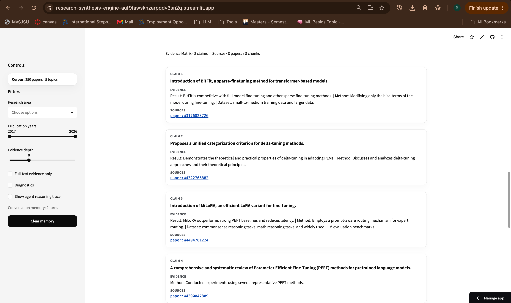

# Multi-Agent Research System

A multi-agent research system built on an orchestrator-worker pattern. A lead agent decomposes research queries into subtasks and delegates to specialized subagents that search in parallel, then synthesizes findings into cited reports scored by an LLM-as-judge.

Built on top of a grounded RAG assistant with 250 AI research papers, hybrid dense+BM25 retrieval, contextual embeddings, and confidence-gated synthesis.

## Architecture

```
User Query
    ↓
LeadResearcher (GPT-4o)
├── Plans approach + classifies complexity
├── Decomposes into subtasks
├── Spawns parallel subagents:
│   ├── LocalCorpusAgent (Qdrant hybrid search)
│   ├── ArxivAgent (arXiv API)
│   ├── SemanticScholarAgent (S2 API)
│   └── WebAgent (Tavily)
│   └── Each: search → evaluate → refine → complete
│   └── Writes findings to shared storage
├── Synthesizes findings
├── "More research needed?" → loop or exit
    ↓
CitationAgent (source attribution)
    ↓
LLM-as-Judge (5 quality dimensions)
    ↓
Final cited report → User
```

## Key design patterns

- **Orchestrator-worker**: Lead agent plans and delegates; subagents execute independently
- **Effort scaling**: Simple queries get 1 agent; complex queries get 3-5 parallel subagents
- **Contextual embeddings**: Document-level context prepended to each chunk before embedding
- **Findings store**: Subagents write to shared storage, avoiding the "game of telephone" effect
- **Iterative research loop**: Lead can spawn follow-up subagents when gaps are identified
- **LLM-as-judge**: Automated scoring on factual accuracy, citation accuracy, completeness, source quality, and tool efficiency

## Core capabilities

- Multi-agent parallel research with orchestrator-worker pattern
- Contextual retrieval with hybrid dense+BM25 search
- Routes questions to paper-level, full-text, hybrid, or metadata retrieval
- Confidence gate declines unsupported questions instead of hallucinating
- Generates grounded research briefs with proper citations
- External tool integration: arXiv, Semantic Scholar, Tavily, MCP servers
- LLM-as-judge evaluation across 5 quality dimensions
- Full observability with structured tracing

## Example questions

- What datasets are used to evaluate hallucination detection methods?
- Compare retrieval-augmented generation with fine-tuning for adding domain knowledge.
- Show highly cited AI agent survey papers published after 2023.
- How much does LoRA reduce GPU memory during fine-tuning?

For questions outside the indexed corpus, the confidence layer returns a refusal or explicitly uses an enabled external source. It does not silently fill gaps with unsupported claims.

## Evaluation

The canonical benchmark contains 100 queries:

- 95 queries with labeled relevant paper or passage IDs
- 5 out-of-corpus confidence checks
- factual, methodology, results, comparison, metadata, reading-path, and refusal cases

Retrieval results with contextual embeddings (default collection):

| Metric | Original | Contextual | Delta |
| --- | ---: | ---: | ---: |
| Hit@10 (85-query benchmark) | 0.376 | 0.459 | +22% |
| MRR (85-query benchmark) | 0.137 | 0.166 | +21% |
| Hit@10 (50-query independent) | 0.640 | 0.700 | +9.4% |
| MRR (50-query independent) | 0.395 | 0.386 | -2.3% |
| Route accuracy | | 1.00 | |
| Confidence decision accuracy | | 1.00 | |

The independent eval set was generated by sampling chunks and using GPT-4o-mini to create natural queries without copying chunk phrasing, preventing generation bias from inflating the numbers.

The optional 46-case agentic benchmark measures planning, route selection, tool plans, external-source coverage, answer or refusal behavior, and citation support. The latest recorded run reported 1.00 route and tool-plan accuracy, 1.00 external-source coverage across 15 cases, 0.978 answer or refusal accuracy, 0.872 citation validity, and 1.00 citation coverage. Provider failures are surfaced as warnings and are not hidden from the metrics.

The repository includes 422 automated tests with external services mocked for deterministic regression testing.

Multi-agent vs single-agent comparison (LLM-as-judge, 5 complex queries):

| Metric | Single-agent | Multi-agent | Delta |
| --- | ---: | ---: | ---: |
| Avg quality score (0-1) | 0.372 | 0.840 | +126% |
| Avg latency | 12.3s | 41.1s | 3.3x |
| Avg agents per query | 1 | 3.0 | |
| Avg findings per query | ~5 | 29.4 | 5.9x |

Multi-agent trades latency for quality: parallel subagents (LocalCorpus, Arxiv, SemanticScholar, Web) cover more ground per query, and the citation + judge passes catch hallucinations the single-agent pipeline misses. Judge dimensions: factual accuracy, citation accuracy, completeness, source quality, tool efficiency.

## Architecture

~~~mermaid
flowchart LR
    User --> Streamlit
    Streamlit --> FastAPI

    subgraph CorpusFlow[Standard corpus workflow]
        FastAPI --> Router[Intent router]
        Router --> PaperRoute[Paper retrieval]
        Router --> ChunkRoute[Full-text retrieval]
        Router --> HybridRoute[Paper and passage retrieval]
        Router --> MetadataRoute[Metadata filters]
        PaperRoute --> DenseP[OpenAI query embedding]
        DenseP --> QdrantP[Qdrant paper collection]
        ChunkRoute --> DenseC[OpenAI query embedding]
        DenseC --> QdrantC[Qdrant chunk collection]
        HybridRoute --> DenseP
        HybridRoute --> DenseC
        PaperRoute --> SparseP[BM25]
        ChunkRoute --> SparseC[Chunk BM25]
        HybridRoute --> SparseP
        HybridRoute --> SparseC
        QdrantP --> Fusion[Score fusion, promotion, optional reranking]
        QdrantC --> Fusion
        SparseP --> Fusion
        SparseC --> Fusion
        MetadataRoute --> Confidence[Confidence gate]
        Fusion --> Confidence
    end

    Confidence -->|sufficient evidence| Synthesis[Grounded GPT-4o-mini synthesis]
    Confidence -->|insufficient evidence| Refusal[Refusal with evidence status]
    Synthesis --> Outputs[Citations and research outputs]

    subgraph AgenticFlow[Optional agentic workflow]
        FastAPI --> Guardrail[Guardrail]
        Guardrail --> Planner[Planner]
        Planner --> LocalTool[Local corpus tool]
        Planner --> ExternalTools[Arxiv, Semantic Scholar, Tavily]
        LocalTool --> AgentDecision{Evidence sufficient?}
        AgentDecision -->|yes| AgentEvidence[Evidence state]
        AgentDecision -->|no| ExternalTools
        ExternalTools --> AgentEvidence
        AgentEvidence --> BoundedSynthesis[Bounded grounded synthesis]
        BoundedSynthesis --> Outputs
    end
~~~

## Data and retrieval design

- 250 paper records are indexed for metadata and abstract retrieval.
- 152 papers have extracted full text.
- 4,909 full-text passages are indexed with section and page metadata using contextual embeddings (document-level context prepended before embedding).
- Paper and passage retrieval use OpenAI text-embedding-3-large embeddings reduced to 1,024 dimensions and BM25.
- Retrieval candidates are fused, promoted using query intent and citation signals, and optionally reranked with a cross-encoder (ms-marco-MiniLM-L-6-v2).
- The canonical vector store is Qdrant. BM25 indexes are local artifacts under data/.

## Technology

| Area | Tools |
| --- | --- |
| Backend | Python, FastAPI, Pydantic |
| Retrieval | Qdrant, BM25, OpenAI embeddings, contextual embeddings, optional cross-encoder |
| Multi-Agent | LangGraph, GPT-4o orchestrator, GPT-4o-mini subagents, parallel execution |
| Synthesis | OpenAI GPT-4o, confidence gate, query rewriting, LLM-as-judge |
| External research | Arxiv, Semantic Scholar, Tavily, MCP tools |
| Data pipeline | OpenAlex, PyMuPDF, section-aware chunking, contextual embeddings |
| Frontend | Streamlit |
| Deployment | Docker Compose, Qdrant |
| Testing | Pytest with mocked external dependencies |

## Local setup

Requirements: Python 3.11+, Docker, and access to an OpenAI-compatible API key. Qdrant Cloud can be used instead of local Qdrant.

~~~bash
python3.11 -m venv .venv
source .venv/bin/activate
pip install -e ".[dev]"
cp .env.example .env
~~~

Set the required values in .env:

~~~text
OPENAI_API_KEY=
QDRANT_URL=http://localhost:6333
QDRANT_API_KEY=
RSE_APPLY_RERANKING=false
TAVILY_API_KEY=
SEMANTIC_SCHOLAR_API_KEY=
~~~

Start the local services:

~~~bash
docker compose up -d qdrant
uvicorn api.main:app --reload
streamlit run ui/streamlit_app.py
~~~

Run the regression suite:

~~~bash
python -m pytest -q
~~~

Run the canonical retrieval benchmark:

~~~bash
python -m retrieval.evaluate \
  --queries tests/fixtures/eval_queries_100_chunk_grounded.json \
  --qdrant-url http://localhost:6333
~~~

## Multi-agent research

Run the multi-agent research pipeline:

~~~bash
# Preview plan only (no API calls to subagents)
curl -X POST http://localhost:8000/multi-agent/plan \
  -H "Content-Type: application/json" \
  -d '{"query": "Compare dense vs sparse retrieval methods"}'

# Full pipeline (plan → subagents → synthesize → cite → judge)
curl -X POST http://localhost:8000/multi-agent/research \
  -H "Content-Type: application/json" \
  -d '{"query": "Compare dense vs sparse retrieval methods"}'

# Streamlit multi-agent UI
streamlit run ui/multi_agent_app.py
~~~

Run the contextual embeddings pipeline:

~~~bash
# Generate contextual embeddings
python -m multi_agent.contextual_embeddings

# Index into Qdrant
python -m multi_agent.index_contextual

# Compare original vs contextual retrieval
python -m multi_agent.compare_retrieval --limit 20
~~~

Run the multi-agent benchmark (single-agent vs multi-agent comparison):

~~~bash
python -m multi_agent.benchmark --limit 5
~~~

Validate agentic planning and recorded responses:

~~~bash
python scripts/evaluate_agentic.py
~~~

## API

| Method | Endpoint | Purpose |
| --- | --- | --- |
| GET | /health | Service health |
| GET | /corpus/stats | Corpus and index statistics |
| POST | /route | Query route preview |
| POST | /retrieve | Retrieval results |
| POST | /confidence | Evidence confidence decision |
| POST | /brief | Grounded research brief |
| POST | /agentic/research | Corpus, live, or hybrid research workflow |

Example request:

~~~bash
curl -X POST http://localhost:8000/agentic/research \
  -H 'Content-Type: application/json' \
  -d '{"question":"What datasets are used for hallucination detection?","top_k":8,"max_tool_calls":3}'
~~~

## Screenshots







## Repository layout

~~~text
ingestion/     Paper collection, extraction, and embeddings
full_text/     PDF extraction, section-aware chunking, and passage indexing
retrieval/     Routing, hybrid search, ranking, confidence, and evaluation
agent/         Research outputs and evidence-grounded synthesis
agentic/       Planner, external tools, tool execution, and traces
api/           FastAPI service
ui/            Streamlit application
mcp_servers/   MCP research tools
tests/         Automated regression tests
docs/          Evaluation methodology and design decisions
~~~

## Known limitations

- Some relevant passages still rank below the top-10 cutoff.
- Multi-paper comparison questions are harder than single-paper factual questions.
- The corpus is curated and does not update automatically.
- Synthesis quality depends on the configured language model and provider availability.
- Free-tier deployments have cold starts.

## Deployment

The API is containerized with api/Dockerfile and deployed on Render. The Streamlit application calls the API through RSE_API_URL. Qdrant Cloud stores the production paper and passage collections. Keep secrets in environment variables and never commit .env.
