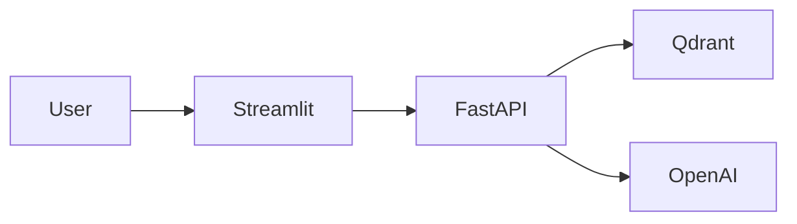
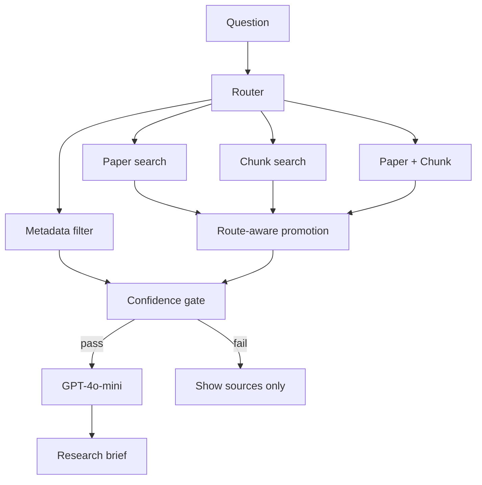
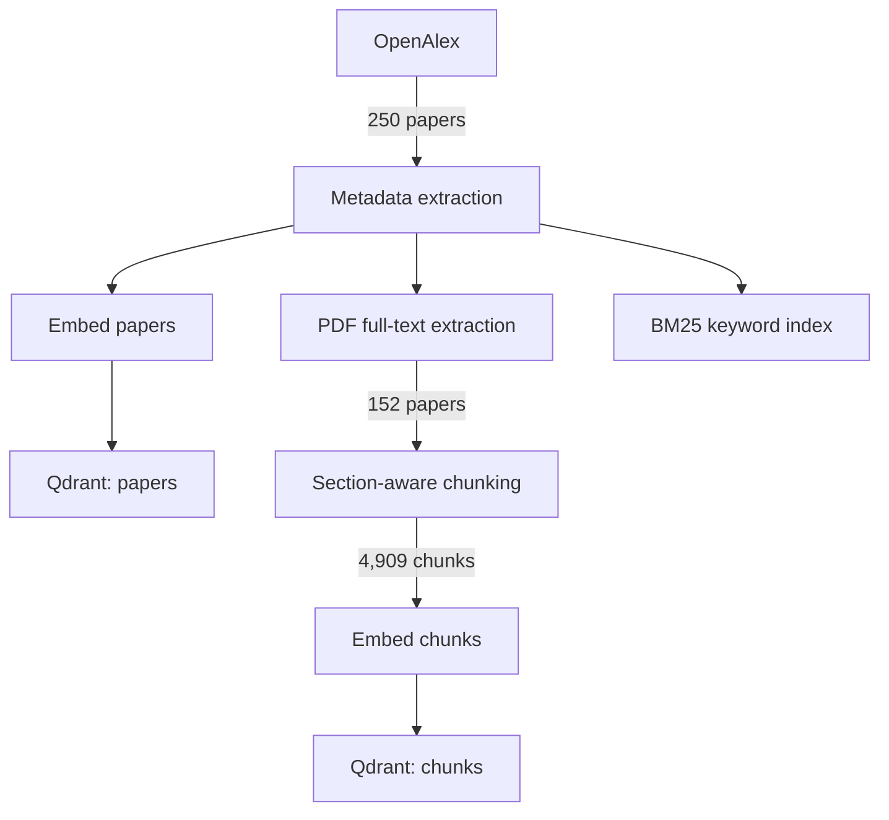
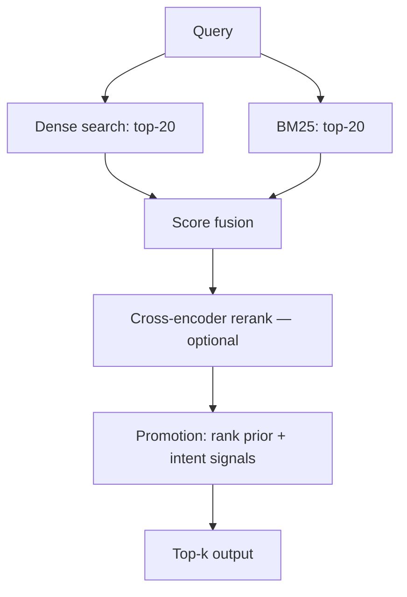

# Research Synthesis Engine

**Tech:** Python | FastAPI | Streamlit | Qdrant | OpenAI embeddings | BM25

A retrieval-augmented research assistant for a curated corpus of 250 AI research papers. It combines dense-vector search, BM25, intent-aware routing, section-aware full-text chunks, and a confidence gate that declines unsupported questions instead of inventing evidence.

The canonical benchmark contains 100 corpus-grounded queries: 95 with labeled relevant paper/chunk IDs and 5 out-of-corpus confidence checks. The current system reaches route accuracy 1.00, hit@10 0.705, Recall@10 0.573, and MRR 0.459. A live answer-quality smoke test scored faithfulness/relevancy at 1.0/1.0 for a factual query and 0.8/1.0 for a comparison query.

The original 250-query audited fixture remains available as the source/provenance set. The application is deployed end-to-end on free-tier infrastructure (Render, Streamlit Cloud, and Qdrant Cloud).

**Try it:** [streamlit app](https://research-synthesis-engine-mhupghrfkhudtzy4uvqzq6.streamlit.app/) · [API](https://research-synthesis-engine-api.onrender.com)

Free-tier hosting — first request after inactivity takes 30–60s to cold-start.

---

## Screenshots


---

## What It Does

1. **Routes** the query to one of four retrieval paths based on what the question needs.
2. **Retrieves** candidates using hybrid search — dense embeddings + BM25.
3. **Promotes** intent-matched candidates using route-aware signals (section hints, vocabulary match, citation weight).
4. **Gates** the answer — if evidence is weak or off-topic, declines to answer.
5. **Synthesizes** a grounded brief with per-claim source attribution.

Example questions:
- `What datasets are used to evaluate hallucination detection methods?`
- `Compare RAG and fine-tuning as ways to inject domain knowledge.`
- `Show me highly cited AI agent survey papers published after 2023.`
- `How much does LoRA reduce GPU memory during fine-tuning?`

If the corpus can't support an answer:
```
Question: What does this system know about marine biology and coral bleaching?
Decision: insufficient_evidence — no answer generated
```

---

## Results

The canonical 100-query benchmark evaluates routing, paper/chunk retrieval, confidence behavior, and evidence coverage. It keeps retrieval, reranking, prompts, and top-k settings fixed.

| Metric | Result |
| --- | ---: |
| Route accuracy | **1.00** |
| Relevant-ID hit@10 | **0.705** |
| Recall@10 | **0.573** |
| MRR | **0.459** |
| Keyword hit@10 | **0.967** |
| Confidence accuracy | **1.00** |

The 250-query audited fixture remains available for provenance and deeper analysis. The current benchmark is intentionally smaller and chunk-grounded so retrieval failures can be traced to exact evidence records. Comparison answers remain the main quality opportunity because they require evidence from multiple papers.

Cross-encoder reranking is available locally but disabled in production because the Render free tier does not have enough memory for the model.

---

## Architecture

### System Overview


```mermaid
flowchart LR
    User --> Streamlit
    Streamlit --> FastAPI
    FastAPI --> Qdrant
    FastAPI --> OpenAI
```

### Query Pipeline


```mermaid
flowchart TD
    Question --> Router
    Router --> Paper[Paper search]
    Router --> Chunk[Chunk search]
    Router --> Hybrid[Paper + Chunk]
    Router --> Metadata[Metadata filter]

    Paper --> Promotion[Route-aware promotion]
    Chunk --> Promotion
    Hybrid --> Promotion
    Metadata --> Gate

    Promotion --> Gate[Confidence gate]
    Gate -->|pass| Synthesis[GPT-4o-mini]
    Gate -->|fail| Decline[Show sources only]
    Synthesis --> Brief[Research brief]
```

### Ingestion Pipeline


```mermaid
flowchart TD
    OpenAlex -->|250 papers| Extraction[Metadata extraction]
    Extraction --> Embedding[Embed papers]
    Embedding --> QdrantPapers[Qdrant: papers]

    Extraction --> PDFs[PDF full-text extraction]
    PDFs -->|152 papers| Chunking[Section-aware chunking]
    Chunking -->|4,909 chunks| EmbedChunks[Embed chunks]
    EmbedChunks --> QdrantChunks[Qdrant: chunks]

    Extraction --> BM25[BM25 keyword index]
```

### Retrieval Detail

Paper-level retrieval fuses dense Qdrant search with BM25. Full-text chunk
retrieval fuses dense Qdrant search with an optional local chunk BM25 index
(data/chunk_bm25_index.pkl); if that artifact is absent, it safely falls back
to dense-only chunk retrieval.


```mermaid
flowchart TD
    Query --> Dense[Dense search: top-20]
    Query --> Sparse[BM25: top-20]
    Dense --> Fusion[Score fusion]
    Sparse --> Fusion
    Fusion --> Rerank[Cross-encoder rerank — optional]
    Rerank --> Promote[Promotion: rank prior + intent signals]
    Promote --> TopK[Top-k output]
```

---

## Corpus

| Item | Count |
| --- | ---: |
| Research areas | 5 |
| Papers indexed | 250 |
| Papers with full text | 152 |
| Full-text chunks | 4,909 |
| Evaluation queries | 100 chunk-grounded (from 250 audited source queries) |
| Exact-ID labeled | 95 (5 out-of-corpus confidence checks) |
| Core tests | 422 tests (Python >=3.11) |

Research areas: Retrieval-Augmented Generation, Transformers & Attention, LLM Evaluation & Hallucination Detection, AI Agents & Tool Use, Fine-tuning (LoRA / PEFT)

---

## Tech Stack

| Layer | Tools |
| --- | --- |
| Retrieval | Qdrant, OpenAI `text-embedding-3-large` (1024d), BM25, weighted/RRF fusion |
| Ranking | Citation-aware scoring, route-aware promotion, optional cross-encoder (`ms-marco-MiniLM-L-6-v2`) |
| Synthesis | GPT-4o-mini, query router, query rewriter, CRAG-style confidence gate |
| Data pipeline | OpenAlex API, PyMuPDF, Pydantic, section-aware chunking |
| Backend | FastAPI, structured errors, request-ID tracing, TTL cache |
| Frontend | Streamlit (streaming, evidence matrix, reading path) |
| Evaluation | 100-query chunk-grounded fixture, hit@k, recall@k, MRR, route accuracy, confidence and faithfulness checks |
| Deployment | Render (Docker), Streamlit Community Cloud, Qdrant Cloud — all free tier |

---

## Design Decisions

- **Hybrid search over dense-only:** keyword-heavy queries (paper titles, method names) need BM25.
- **Confidence gate is conservative:** declining to answer is preferred over hallucinating.
- **Cross-encoder disabled in production:** Render free tier = 512MB. The model alone needs ~512MB. Fallback preserves retrieval order.
- **MMR disabled by default:** measured it, hurt recall (0.65 → 0.62 at k=5). Most queries want depth in one paper, not diversity.
- **Pool-invariant promotion:** bonuses depend only on a candidate's own rank and payload. Widening the pool can't rescale existing candidates.

---

## Local Setup

```bash
python3.11 -m venv .venv && source .venv/bin/activate
pip install -e ".[dev]"
cp .env.example .env
```

Required `.env`:
```
OPENAI_API_KEY=
QDRANT_URL=http://localhost:6333
QDRANT_API_KEY=
RSE_APPLY_RERANKING=false
TAVILY_API_KEY=
SEMANTIC_SCHOLAR_API_KEY=
```

The optional agentic route sends current or external questions to Arxiv, Semantic Scholar, and Tavily. Generic research questions probe the canonical Qdrant and BM25 corpus first; if local evidence is below the confidence threshold, the planner falls back to external coverage. Explicit corpus requests remain local, and obvious non-research questions never trigger external calls. If a provider is unavailable, the route returns a warning and preserves the available evidence. The Streamlit Research mode selector exposes this route and shows the planner decision, tool calls, evidence, citations, confidence, latency, and token usage. The API endpoint is `POST /agentic/research`. The MCP server can be started with `python -m mcp_servers.research_tools`.

Run:
```bash
docker compose up -d qdrant
uvicorn api.main:app --reload
streamlit run ui/streamlit_app.py
```

Evaluate the canonical benchmark:
```bash
python -m retrieval.evaluate \
  --queries tests/fixtures/eval_queries_100_chunk_grounded.json \
  --qdrant-url http://localhost:6333
python -m pytest -q
```


Validate the 46-case agentic planner and external-routing benchmark and optional recorded-response metrics:
```bash
python scripts/evaluate_agentic.py
```

The latest recorded 46-case run (top_k=8, max_tool_calls=3) achieved 1.00 planner and response route/tool-plan accuracy, 1.00 external-source coverage (15 cases), 0.978 answer-or-refusal accuracy, 0.872 citation validity, and 1.00 citation coverage. Tool success was 0.942 because provider retries and rate limits are reported rather than hidden; rerun this benchmark when provider availability changes.

Run a live agentic smoke test only when the API, Qdrant, and provider keys are available:
```bash
curl -X POST http://localhost:8000/agentic/research \
  -H 'Content-Type: application/json' \
  -H 'X-Request-ID: manual-agentic-smoke-1' \
  -d '{"question":"What are the latest papers on hallucination detection?","top_k":3,"max_tool_calls":2}'
```

The 250-query audited fixture remains available as the source/provenance set:
```bash
python -m retrieval.evaluate \
  --queries tests/fixtures/eval_queries_250_audited.json \
  --qdrant-url http://localhost:6333
```
When indexing locally, pass the same endpoint explicitly so a Cloud URL in a
different `.env` cannot silently receive the new vectors:

```bash
python retrieval/index_qdrant.py --qdrant-url http://localhost:6333
python full_text/index_chunks_qdrant.py --qdrant-url http://localhost:6333
python -m retrieval.chunk_bm25
```

Optional — local cross-encoder:
```bash
pip install -r requirements-rerank.txt
# omit --no-rerank to enable (on by default when torch is installed)
```

---

## API

```
GET  /health              Health check
GET  /corpus/stats        Corpus statistics
POST /route               Route preview
POST /retrieve            Retrieval results
POST /confidence          Confidence check
POST /brief               Research brief
POST /evidence-matrix     Claim-level attribution
POST /reading-path        Paper recommendations
POST /open-problems       Research gaps
POST /guidance            Guided session
POST /agent/research      Multi-step research agent
```

---

## Deployment

| Service | Role |
| --- | --- |
| Qdrant Cloud | Vector database (free 1GB) |
| Render | FastAPI backend (Docker, health check at `/health`) |
| Streamlit Cloud | UI (`RSE_API_URL` → Render) |

Env vars for Render: `OPENAI_API_KEY`, `QDRANT_URL`, `QDRANT_API_KEY`, `RSE_APPLY_RERANKING=false
TAVILY_API_KEY=
SEMANTIC_SCHOLAR_API_KEY=`, `RSE_CORS_ORIGINS`.

---

## Current Evaluation Snapshot

On the canonical 100-query benchmark (95 queries with labeled relevant IDs):

| Metric | Result |
| --- | ---: |
| Route accuracy | 1.00 |
| Hit@10 | 0.705 |
| Recall@10 | 0.573 |
| MRR | 0.459 |
| Keyword hit@10 | 0.967 |
| Confidence accuracy | 1.00 |

A small live answer-quality smoke test scored faithfulness/relevancy at 1.0/1.0 for a factual query and 0.8/1.0 for a comparison query. This is a smoke sample, not a substitute for a larger human-labeled generation benchmark.

## Limitations

- Some relevant evidence still falls below the top-10 cutoff.
- Comparison answers need broader multi-paper evidence coverage.
- Static corpus, no incremental updates.
- Synthesis depends on GPT-4o-mini.
- Free-tier cold starts: 30-60s.

## Repository Layout

```
ingestion/     Paper collection, metadata extraction, embeddings
full_text/     PDF discovery, text extraction, chunking, chunk embeddings
retrieval/     Indexing, BM25, routing, hybrid search, promotion, evaluation
agent/         Query rewriting, confidence gate, synthesis, evidence outputs
api/           FastAPI service
ui/            Streamlit app
shared/        Pydantic schemas
tests/         422 tests (mocked external dependencies)
docs/          Decision log, evaluation methodology, failure analysis
```
