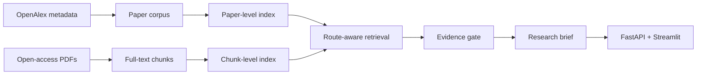
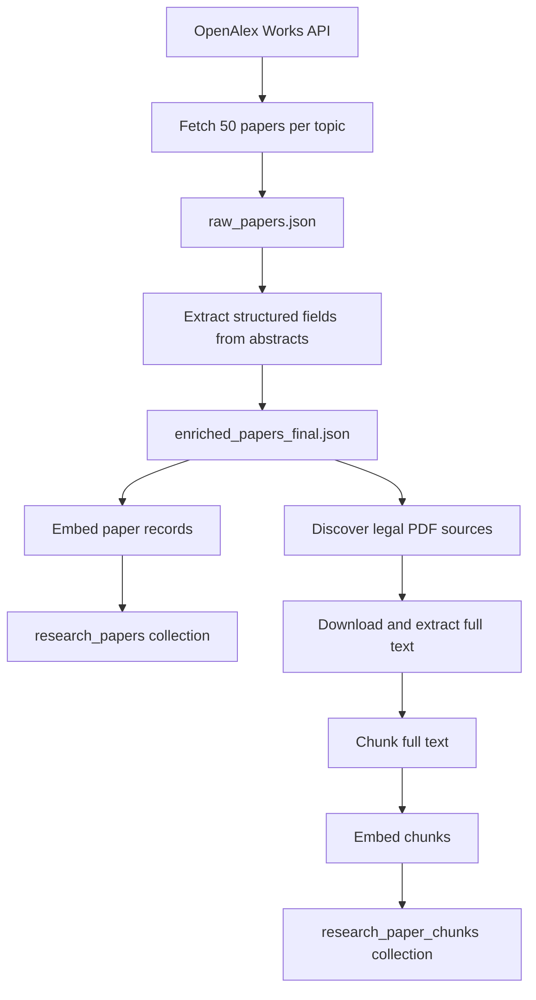
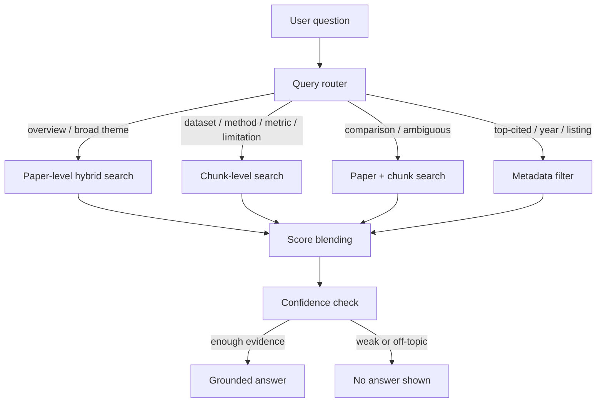

# Research Synthesis Engine

A research assistant for AI papers. It builds a curated corpus, indexes abstracts and available full text, then answers questions with retrieved evidence instead of relying on a plain generated summary.

Live app: [research-synthesis-engine.streamlit.app](https://research-synthesis-engine-auf9fawskhzarpqdv3sn2q.streamlit.app/)  
API: [research-synthesis-engine-api.onrender.com](https://research-synthesis-engine-api.onrender.com)

## What It Does

The system supports literature questions such as:

- `What are the main approaches for reducing hallucinations in LLMs?`
- `Compare LoRA and BitFit for parameter-efficient fine-tuning.`
- `Show me highly cited AI agent survey papers published after 2023.`
- `Explain the BitFit paper.`
- `What datasets are used to evaluate LoRA fine-tuning?`

For each query, it decides whether to search paper-level metadata, full-text chunks, or both. If the retrieved evidence is weak or outside the corpus, the system refuses to synthesize an answer and shows the closest retrieved sources instead.

## Current Corpus

| Item | Count |
| --- | ---: |
| Research areas | 5 |
| Papers | 250 |
| Papers with extracted full text | 152 |
| Full-text chunks | 4,909 |
| Paper-level Qdrant points | 250 |
| Chunk-level Qdrant points | 4,909 |
| Evaluation queries | 50 |
| Exact-ID labeled evaluation queries | 36 |
| Test suite | 303 passing tests |

Research areas:

- Retrieval-Augmented Generation (RAG)
- Transformers / Attention Mechanisms
- LLM Evaluation & Hallucination Detection
- AI Agents & Tool Use
- Fine-tuning (LoRA / PEFT)

## System Overview


```mermaid
flowchart LR
    A["OpenAlex metadata"] --> B["Paper corpus"]
    C["Open-access PDFs"] --> D["Full-text chunks"]
    B --> E["Paper-level index"]
    D --> F["Chunk-level index"]
    E --> G["Route-aware retrieval"]
    F --> G
    G --> H["Evidence gate"]
    H --> I["Research brief"]
    I --> J["FastAPI + Streamlit"]
```

The project has two main parts:

- **Offline pipeline:** builds the paper corpus, extracts structured metadata, embeds papers and chunks, and indexes Qdrant.
- **Live pipeline:** routes user questions, retrieves evidence, checks confidence, and generates the answer shown in the UI.

## Offline Ingestion Pipeline


```mermaid
flowchart TD
    A["OpenAlex Works API"] --> B["Fetch 50 papers per topic"]
    B --> C["raw_papers.json"]
    C --> D["Extract structured fields from abstracts"]
    D --> E["enriched_papers_final.json"]
    E --> F["Embed paper records"]
    F --> G["research_papers collection"]
    E --> H["Discover legal PDF sources"]
    H --> I["Download and extract full text"]
    I --> J["Chunk full text"]
    J --> K["Embed chunks"]
    K --> L["research_paper_chunks collection"]
```

The paper-level index covers all 250 papers. The chunk-level index covers the 152 papers where legal full text was available and extractable.

## Retrieval Pipeline


```mermaid
flowchart TD
    A["User question"] --> B["Query router"]
    B -->|"overview / broad theme"| C["Paper-level hybrid search"]
    B -->|"dataset / method / metric / limitation"| D["Chunk-level search"]
    B -->|"comparison / ambiguous"| E["Paper + chunk search"]
    B -->|"top-cited / year / listing"| F["Metadata filter"]
    C --> G["Score blending"]
    D --> G
    E --> G
    F --> G
    G --> H["Confidence check"]
    H -->|"enough evidence"| I["Grounded answer"]
    H -->|"weak or off-topic"| J["No answer shown"]
```

The deployed Render service runs with `RSE_APPLY_RERANKING=false` to stay inside free-tier memory limits. Local runs can enable the cross-encoder reranker for experiments.

## Answer Format

The Streamlit app shows the result in a compact research workspace:

- Direct answer
- Research themes when useful
- Evidence matrix
- Source cards with papers and chunks
- Optional diagnostics
- Context-aware follow-up questions

The evidence matrix is intentionally small in the UI. It focuses on the claim/evidence/source relationship instead of exposing every internal field.

## Confidence Gate

Before generation, the system checks whether retrieved evidence supports the question. This is especially important for out-of-corpus queries.

Example tested behavior:

```text
Question: What does this system know about marine biology and coral bleaching?
Decision: insufficient_evidence
Result: no grounded answer shown
```

The UI still shows the closest retrieved papers so the user can inspect why the system declined to answer.

## Evaluation

The main evaluation fixture is `tests/fixtures/eval_queries.json`.

| Evaluation focus | Queries | Purpose |
| --- | ---: | --- |
| Full-text evidence | 19 | Dataset, method, metric, result, and limitation retrieval |
| Cross-topic comparison | 7 | Questions that need multiple topics or retrieval levels |
| Confidence gate | 6 | Out-of-corpus or weak-evidence behavior |
| Metadata filter | 6 | Top-cited and year-filtered queries |
| Contextual rewrite | 5 | Follow-up questions with chat history |
| Route selection | 6 | Broad overview routing |
| Reading path | 1 | Reading recommendation behavior |

Latest documented evaluation run:

| Metric | Value | Scope |
| --- | ---: | --- |
| Route accuracy | 1.00 | 50 queries |
| Topic hit rate@10 | 1.00 | 44 topic-labeled queries |
| Keyword hit rate@10 | 0.94 | 48 keyword-labeled queries |
| Relevant-ID hit rate@10 | 1.00 | 36 exact-ID labeled queries |
| Recall@10 | 0.76 | 36 exact-ID labeled queries |
| MRR | 0.75 | 36 exact-ID labeled queries |
| Confidence decision accuracy | 1.00 | 6 confidence-labeled queries |
| CRAG fallback success rate | 1.00 | 6 fallback queries |

`Hit rate@K` and `Recall@K` are reported separately. Hit rate checks whether at least one labeled relevant item appears in the top K. Recall checks what fraction of all labeled relevant items were retrieved.

More detail is in [`docs/EVALUATION.md`](docs/EVALUATION.md).

## Performance

The UI was changed so the first response returns the direct answer and evidence matrix before heavier sections. On the hallucination demo query, this reduced initial response latency from about 21.3 seconds to about 8.8 seconds.

| Mode | Initial response |
| --- | ---: |
| Full guidance in one call | 21.3s |
| Fast-first response | 8.8s |

The API also keeps a small in-memory cache for repeated demo queries.

## Tech Stack

- Python
- FastAPI
- Streamlit
- Qdrant
- OpenAlex API
- OpenAI API: `gpt-4o-mini`, `text-embedding-3-large`
- Pydantic
- BM25 with `rank-bm25`
- Pytest
- Docker / Docker Compose
- Render, Streamlit Community Cloud, Qdrant Cloud

## Local Setup

Create an environment:

```bash
python -m venv .venv
source .venv/bin/activate
pip install -e ".[dev]"
cp .env.example .env
```

Required values for a full local run:

```bash
OPENAI_API_KEY=
QDRANT_URL=http://localhost:6333
QDRANT_API_KEY=
OPENALEX_API_KEY=
OPENALEX_EMAIL=
RSE_API_URL=http://localhost:8000
RSE_CORS_ORIGINS=http://localhost:8501,http://127.0.0.1:8501
RSE_APPLY_RERANKING=false
```

Start local Qdrant:

```bash
docker compose up -d qdrant
```

Start the API:

```bash
uvicorn api.main:app --reload
```

Start the UI:

```bash
RSE_API_URL=http://localhost:8000 streamlit run ui/streamlit_app.py
```

## Main Commands

Fetch papers:

```bash
python -m ingestion.fetch_papers --per-topic 50 --output data/raw_papers.json
```

Extract structured metadata:

```bash
python -m ingestion.extract --model gpt-4o-mini
```

Embed papers:

```bash
python -m ingestion.embed --model text-embedding-3-large --batch-size 32
```

Index paper vectors:

```bash
python -m retrieval.index_qdrant
```

Build BM25:

```bash
python -m retrieval.build_bm25
```

Discover and extract full text:

```bash
python -m full_text.discover_sources --input data/enriched_papers_final.json --output data/full_text_sources.json
python -m full_text.download_extract --input data/full_text_selected_all.json --output data/full_text_papers.json --pdf-dir data/pdfs --append-existing
```

Chunk and index full text:

```bash
python -m full_text.chunk_papers --input data/full_text_papers.json --output data/full_text_chunks.json --max-words 450 --overlap-words 75
python -m full_text.embed_chunks --input data/full_text_chunks.json --output data/embedded_full_text_chunks.json --batch-size 64 --dimensions 1024
python -m full_text.index_chunks_qdrant --input data/embedded_full_text_chunks.json --collection research_paper_chunks
```

Run retrieval evaluation:

```bash
python -m retrieval.evaluate --queries tests/fixtures/eval_queries.json
```

Run tests:

```bash
python -m pytest tests/ -q
```

## API

Useful endpoints:

```text
GET  /health
GET  /corpus/stats
POST /route
POST /retrieve
POST /confidence
POST /brief
POST /evidence-matrix
POST /reading-path
POST /open-problems
POST /guidance
POST /agent/research
```

Example request:

```bash
curl -X POST http://localhost:8000/guidance \
  -H "Content-Type: application/json" \
  -H "X-Request-ID: demo-request-001" \
  -d '{"question":"Compare LoRA and BitFit for parameter-efficient fine-tuning.","top_k":8,"include_debug":false}'
```

Request fields:

```text
question: user question
query: backward-compatible alias for question
research_areas: optional corpus topic filter
publication_year_min / publication_year_max: optional year filters
full_text_only: prefer full-text chunk evidence
include_debug: include route signals, score details, and timings
chat_history: prior turns used for follow-up rewriting
```

Every response includes an `X-Request-ID` header. Structured API errors include an error code, message, details, and request ID.

## Deployment

The current deployment uses:

```text
Qdrant Cloud        vector database
Render              FastAPI backend
Streamlit Cloud     user interface
```

Render settings:

```text
Runtime: Docker
Dockerfile Path: api/Dockerfile
Docker Build Context Directory: .
Health Check Path: /health
```

Backend environment variables:

```bash
OPENAI_API_KEY=
QDRANT_URL=
QDRANT_API_KEY=
RSE_APPLY_RERANKING=false
RSE_CORS_ORIGINS=https://research-synthesis-engine-auf9fawskhzarpqdv3sn2q.streamlit.app
RSE_QUERY_CACHE_TTL_SECONDS=300
RSE_QUERY_CACHE_MAX_ENTRIES=128
```

Streamlit Cloud environment variable:

```bash
RSE_API_URL=https://research-synthesis-engine-api.onrender.com
```

## Repository Layout

```text
ingestion/     OpenAlex ingestion, extraction, paper embeddings
full_text/     PDF discovery, extraction, chunking, chunk embeddings
retrieval/     Qdrant indexing, BM25, routing, unified search, evaluation
agent/         query rewriting, confidence-gated synthesis, evidence outputs
api/           FastAPI service
ui/            Streamlit app and UI API client
shared/        Pydantic schemas
tools/         command-line helpers and benchmarks
tests/         unit and integration tests with mocked external calls
docs/          decisions, evaluation notes, demo script, build plan
```

## Notes

- The corpus is intentionally limited to five AI research areas.
- Papers without legal full text remain searchable through abstracts.
- Free-tier deployment disables the local cross-encoder reranker to avoid memory issues.
- The confidence gate is conservative by design; unsupported questions do not receive a generated answer.
