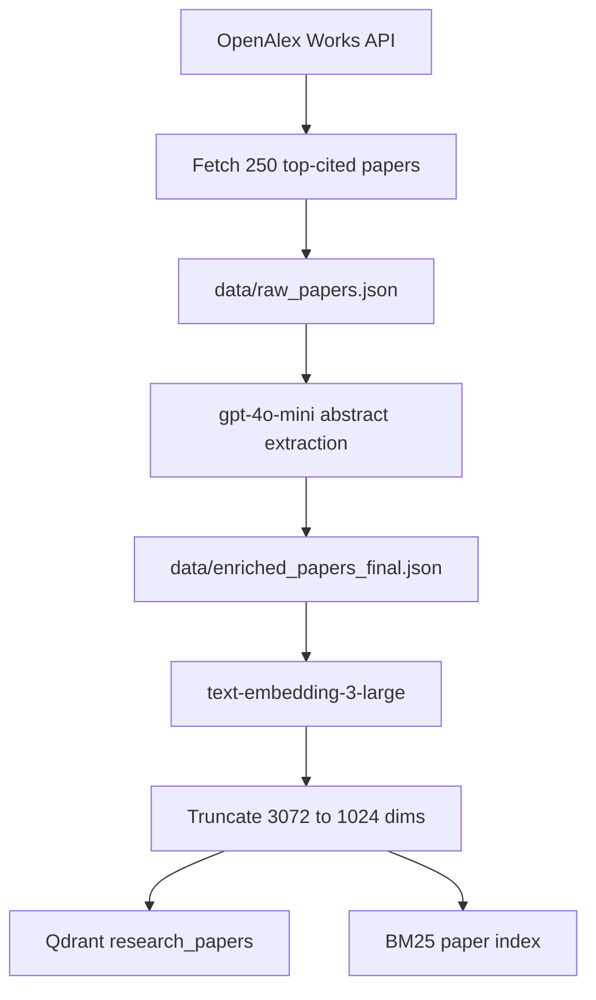
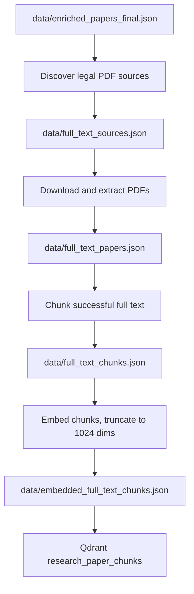
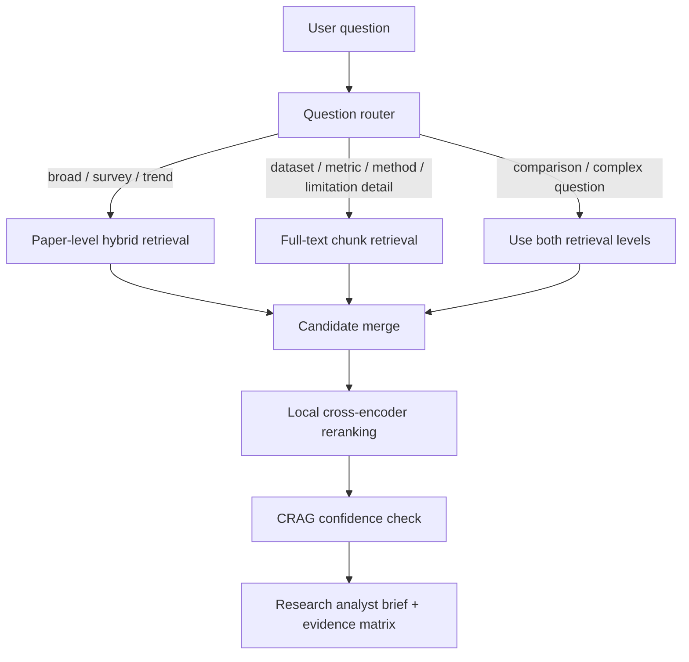

# Research Synthesis Engine - Revised Day-by-Day Build Plan

Window: 25 days  
Current status: ingestion, paper-level retrieval, tool wrapper, full-text chunk indexing, query routing, standalone reranking, and citation-aware scoring are complete.

## Final Positioning

Research Synthesis Engine is a literature intelligence system for AI research papers. It ingests top-cited papers from OpenAlex, extracts structured metadata from abstracts, builds paper-level and full-text chunk-level retrieval indexes, and generates evidence-backed research analyst outputs from user questions.

The project is intentionally not a generic RAG chatbot. The final output should feel like a research analyst brief: a direct answer, research themes, an evidence matrix, a recommended reading path, open problems, and optional timeline/context.

## Current Corpus

```text
paper-level corpus: 250 papers
research topics: 5
papers per topic: 50
abstract/enriched paper embeddings: 250
BM25 paper documents: 250
legal full-text PDF sources discovered: 173
successfully extracted full-text papers: 131
full-text chunks: 4170
embedded full-text chunks: 4170
```

Qdrant collections:

```text
research_papers
-> 250 paper-level vectors from title, abstract, and structured metadata

research_paper_chunks
-> 4170 full-text chunk vectors from 131 open/full-text papers
```

## Research Topics

```text
1. Retrieval-Augmented Generation (RAG)
2. Transformers / Attention Mechanisms
3. LLM Evaluation & Hallucination Detection
4. AI Agents & Tool Use
5. Fine-tuning (LoRA / PEFT)
```

## Core Design Decisions

- Use OpenAlex instead of Semantic Scholar because OpenAlex worked reliably at this scale and provides open-access metadata.
- Use batch ingestion instead of Kafka because the corpus is finite, inspectable, and does not need real-time streaming.
- Use local BM25 and Qdrant for hybrid retrieval.
- Use `text-embedding-3-large` and store 1024-dimensional truncated vectors.
- Use `gpt-4o-mini` for cost-aware structured extraction from abstracts.
- Keep generated data and PDFs local; commit code, tests, docs, and reproducible commands.
- Use two retrieval levels: paper-level retrieval for broad discovery, full-text chunk retrieval for detailed evidence.
- Store full-text chunks in a separate Qdrant collection instead of mixing them with paper-level vectors.

---

## Architecture

### Offline Ingestion And Indexing



### Full-Text Expansion



### Live Query Flow



## Expected User Experience

The user should not need to know the exact papers in the corpus. The UI should show available research areas, suggested questions, and a free-text question box.

Example questions:

```text
What are the main approaches for reducing hallucinations in LLMs?
Which datasets and metrics are used to evaluate hallucination detection?
Compare RAG and self-verification methods for reducing hallucinations.
What are common limitations in AI agent tool-use papers?
Which LoRA/PEFT papers should I read first and why?
```

Expected output:

1. Direct answer
2. Research themes
3. Evidence matrix
4. Recommended reading path
5. Open problems
6. Optional timeline
7. Source citations and retrieved evidence snippets

---

# Completed Work

## Day 1: Project Skeleton + Schemas - Complete

Implemented:
- Repository structure: `ingestion/`, `retrieval/`, `agent/`, `tools/`, `api/`, `ui/`, `shared/`, `tests/`, `data/`, `docs/`
- `pyproject.toml`
- `.env.example`
- `shared/schemas.py`
- `docs/DECISIONS.md`
- Initial day-by-day plan in docs

Checkpoint:
```text
repo exists
schemas defined
dependencies installable
decision log started
```

## Day 2: OpenAlex Paper Ingestion - Complete

Implemented:
- `ingestion/fetch_papers.py`
- OpenAlex API ingestion for 5 topics
- 50 papers per topic
- Citation-count-oriented selection
- Abstract reconstruction from OpenAlex inverted index
- Missing abstract/title filtering

Local artifact:
```text
data/raw_papers.json -> 250 papers
```

Checkpoint:
```text
250 raw papers
5 topics
50 papers per topic
OpenAlex IDs and metadata retained
```

## Day 3: LLM Extraction From Abstracts - Complete

Implemented:
- `ingestion/extract.py`
- `gpt-4o-mini` structured extraction
- Pydantic validation
- Retry-once behavior
- Progress saving
- Mocked tests
- Manual spot-check document

Extracted fields:
```text
main_contribution
methodology
dataset_used
key_result
limitations
```

Local artifact:
```text
data/enriched_papers_final.json -> 250 papers
```

Important wording:
```text
missing dataset/result/limitation values use "not stated in abstract"
```

## Day 4: Paper-Level Embeddings - Complete

Implemented:
- `ingestion/embed.py`
- `text-embedding-3-large`
- 3072-dimensional OpenAI embeddings
- 1024-dimensional stored vectors via truncation
- Batched embedding
- Resume/skipping behavior

Local artifact:
```text
data/embedded_papers.json -> 250 embedded papers
```

Checkpoint:
```text
250 paper-level embeddings
stored dimensions: 1024
full model dimensions: 3072
```

## Day 5: Qdrant + BM25 Paper Indexing - Complete

Implemented:
- `retrieval/index_qdrant.py`
- `retrieval/build_bm25.py`
- Qdrant local/server support
- Stable UUIDv5 point IDs
- BM25 sparse index

Local artifacts:
```text
data/bm25_index.pkl
Qdrant collection: research_papers -> 250 points
```

Checkpoint:
```text
paper-level dense retrieval works
paper-level sparse retrieval works
manual sanity queries return relevant papers
```

## Day 6: Hybrid Retrieval Wrapper - Complete

Implemented:
- `retrieval/hybrid_search.py`
- Dynamic user query embedding
- Dense Qdrant search
- BM25 sparse search
- Candidate merge/deduplication
- Hybrid score
- Tests with mocked clients

Checkpoint:
```text
free-text question -> ranked candidate papers
no hardcoded questions or answers
```

## Day 7: Tool-Style Retrieval Interface - Complete

Implemented:
- `RetrievalRequest`
- `RetrievedPaper`
- `RetrievalResponse`
- `tools/research_retrieval.py`
- JSON CLI output
- Tool-facing error handling
- Tests with mocked retrieval

Checkpoint:
```text
retrieval has a stable schema for future API, agent, and UI layers
```

## Day 8: Full-Text Source Discovery - Complete

Implemented:
- `full_text/discover_sources.py`
- Existing arXiv source detection
- OpenAlex open-access PDF source discovery
- Source-type labeling
- Topic/source summaries
- Tests

Local artifact:
```text
data/full_text_sources.json
```

Result:
```text
checked: 250 papers
legal full-text sources available: 173
arXiv sources: 49
OpenAlex open-access PDF sources: 124
unavailable: 77
```

## Day 9: Full-Text Selection + PDF Extraction - Complete

Implemented:
- `full_text/select_sources.py`
- `full_text/download_extract.py`
- Topic-balanced source selection
- Expansion to all legal sources
- PDF download
- PDF text extraction using `pypdf`
- Failure recording without crashing the batch
- Tests

Local artifacts:
```text
data/full_text_selected.json
data/full_text_selected_all.json
data/full_text_papers.json
data/pdfs/
```

Result:
```text
legal PDF sources attempted: 173
successful full-text extractions: 131
failed downloads/extractions: 42
total extracted pages: 2533
total extracted text characters: 10343086
```

## Day 10: Full-Text Chunking + Qdrant Chunk Index - Complete

Implemented:
- `full_text/chunk_papers.py`
- `full_text/embed_chunks.py`
- `full_text/index_chunks_qdrant.py`
- Section-hinted chunking
- Chunk embeddings with `text-embedding-3-large`
- 1024-dimensional chunk vectors
- Qdrant chunk collection
- Tests

Local artifacts:
```text
data/full_text_chunks.json -> 4170 chunks
data/embedded_full_text_chunks.json -> 4170 embedded chunks
Qdrant collection: research_paper_chunks -> 4170 points
```

Checkpoint:
```text
chunk-level full-text retrieval works
live query returned detailed hallucination benchmark/dataset chunks
```

## Day 11: Query Router - Complete

Implemented:
- `retrieval/router.py`
- `QueryRoute` schema in `shared/schemas.py`
- Four route types:
  - `paper_level`
  - `chunk_level`
  - `hybrid_both`
  - `metadata_filter`
- Rule-based query signal scoring
- Ambiguous-query fallback to `hybrid_both`
- JSON CLI for route sanity checks
- Tests for broad, detailed, comparison, metadata, and ambiguous queries

Routing examples:

| Query | Route |
| --- | --- |
| What are the main approaches for reducing hallucinations? | paper_level |
| Which datasets are used for hallucination detection? | chunk_level |
| Compare RAG and self-verification methods. | hybrid_both |
| Show recent AI agent papers. | metadata_filter |
| Tell me about hallucination detection. | hybrid_both fallback |

`hybrid_both` behavior:
- Return paper-level results and chunk-level results as two separate result sets.
- Do not merge papers and chunks into one ranked list at the router stage.
- Day 12 context assembly can use paper results for broad coverage and chunk results for specific evidence.

Checkpoint:
```text
user question -> route decision with reason, confidence, and matched signals
```


---

# Upcoming Work

## Day 12: Unified Retrieval Service

Goal: combine paper-level and chunk-level retrieval behind one callable interface.

Implement:
- `retrieval/unified_search.py`
- Paper retrieval using existing hybrid search
- Chunk retrieval using `research_paper_chunks`
- Optional topic filters
- Output schema that can return both papers and chunks
- CLI sanity checks
- Tests with mocked retrievers

Checkpoint:
```text
one query can return paper candidates, chunk evidence, or both
```

## Day 13: Local Cross-Encoder Reranking - Complete As Standalone Component

Implemented:
- `retrieval/rerank.py`
- Lazy-loaded local `sentence-transformers` cross-encoder support
- Candidate text builder for both paper-level records and full-text chunks
- Raw rerank score capture
- Normalized `rerank_score` in the 0..1 range
- Tests with mocked cross-encoder scoring

Integration note:
- The reranker is ready to be called by Day 12 unified retrieval.
- For `hybrid_both`, paper results and chunk results should be reranked within their own result sets first.

Checkpoint:
```text
candidate list + query -> reranked candidates with raw and normalized relevance scores
```

## Day 14: Citation-Aware Blended Scoring - Complete As Standalone Component

Implemented:
- Citation normalization with `log1p(citation_count)`
- Default blended score:
  `0.75 * rerank_score + 0.25 * normalized_citation_score`
- `citation_score` field
- `blended_score` field
- `score_breakdown` field with rerank/citation weights
- Tests for deterministic scoring and bad weight validation

Integration note:
- The scoring utility is ready for Day 12 unified retrieval output.
- Scores are interpreted within one candidate set; paper and chunk scores are not forced into one mixed ranking yet.

Checkpoint:
```text
reranked candidates -> citation-aware blended ranking with transparent score breakdown
```

## Day 15: Retrieval Evaluation Set

Goal: measure retrieval quality with real, small, human-readable test questions.

Implement:
- `tests/fixtures/eval_queries.json`
- 15-25 evaluation queries across all five topics
- Expected relevant paper titles or source topics
- Recall@5, Recall@10, MRR
- Simple evaluation runner

Checkpoint:
```text
real retrieval metrics exist and can be reported honestly
```

## Day 16: CRAG Confidence Guardrail

Goal: prevent weak retrieval from flowing directly into answer generation.

Implement:
- Confidence score from top retrieval scores and agreement between paper/chunk results
- Low-confidence behavior:
  - broaden search
  - ask clarifying question
  - or state insufficient evidence
- Tests for low-confidence and high-confidence cases

Checkpoint:
```text
system can say when evidence is weak instead of hallucinating
```

## Day 17: Research Brief Generator

Goal: generate the main user-facing answer.

Implement:
- `agent/synthesis.py` or `tools/research_brief.py`
- Uses retrieved papers/chunks only
- Includes citations
- Explicitly avoids unsupported claims
- Prompt asks for:
  - direct answer
  - themes
  - evidence bullets
  - limitations/open problems

Checkpoint:
```text
user query -> retrieved evidence -> grounded research brief
```

## Day 18: Evidence Matrix Generator

Goal: make the output stronger than a generic summary.

Implement:
- Evidence matrix rows:
  - theme/claim
  - supporting papers
  - methodology
  - dataset
  - key result
  - limitation
  - source chunks
  - evidence strength
- JSON + Markdown output
- Tests using fixed retrieved examples

Checkpoint:
```text
answer includes inspectable structured evidence
```

## Day 19: Reading Path + Open Problems

Goal: recommend how someone should study the topic.

Implement:
- Reading path ordered by foundational -> methods -> evaluation -> recent/open problems
- Use citation count, year, and topic coverage
- Open problems from limitations and full-text chunks

Checkpoint:
```text
system recommends what to read first and why
```

## Day 20: FastAPI Backend

Goal: expose the system through API endpoints.

Implement endpoints:
```text
/health
/query
/retrieve
/brief
/evidence-matrix
/reading-path
/corpus/stats
```

Tests:
- Mock OpenAI
- Mock retrieval where needed
- Validate response schemas

Checkpoint:
```text
backend can serve retrieval and synthesis results
```

## Day 21: Streamlit Dashboard

Goal: create a usable demo UI.

UI should include:
- Topic selector
- Suggested questions
- Free-text query box
- Research brief tab
- Evidence matrix tab
- Reading path tab
- Retrieved papers/chunks tab
- Debug scores panel

Checkpoint:
```text
non-technical user can ask a research question and inspect evidence
```

## Day 22: Cleanup + Storage Management

Goal: make the local project manageable and reproducible.

Tasks:
- Confirm Qdrant paper and chunk collections exist
- Confirm JSON artifacts exist
- Optional deletion of `data/pdfs/` after verifying extracted text/chunks/embeddings
- Add cleanup command docs
- Add corpus stats command

Checkpoint:
```text
PDFs can be safely deleted after extraction and indexing are verified
```

## Day 23: README + Architecture Polish

Goal: make GitHub/interview view excellent.

Tasks:
- Update architecture diagrams
- Add current corpus stats
- Add example query/output
- Add exact rebuild commands
- Add decision summary
- Remove day-number framing from top-level README where appropriate

Checkpoint:
```text
README reads like a professional engineering project, not a course assignment
```

## Day 24: Demo Script + Resume Bullets

Goal: prepare project presentation.

Deliverables:
- 3-minute demo flow
- Interview talking points
- Resume bullets
- Tradeoff explanations:
  - why OpenAlex
  - why batch not Kafka
  - why Qdrant + BM25
  - why local cross-encoder
  - why abstract + full-text indexes
  - why 1024-dimensional truncation

Checkpoint:
```text
project story is clear and internship-ready
```

## Day 25: Buffer + Final Validation

Goal: final hardening.

Tasks:
- Run full tests
- Run representative queries
- Check cost and token usage notes
- Check generated artifacts
- Check GitHub state
- Optional deployment if time allows

Checkpoint:
```text
project is stable, explainable, and demo-ready
```

---

# Current Immediate Next Step

Build **Day 12: Unified Retrieval Service**.

This is now the right next step because the router can already choose among:

```text
paper_level      -> broad paper retrieval
chunk_level      -> detailed full-text evidence retrieval
hybrid_both      -> both result sets, returned separately
metadata_filter  -> citation/year/topic-oriented filtering
```

The unified service will execute the selected route and wire the completed reranking and citation-aware scoring utilities into the returned result sets.

# Minimum Viable Final Demo

If time gets tight, ship:

```text
paper-level + chunk-level retrieval
query router
research brief
simple evidence matrix
Streamlit UI
README with real corpus stats
```

Do not cut:
- real data
- citations/evidence
- retrieval transparency
- tests for external API boundaries

Can cut if needed:
- LangGraph
- MCP server boundary
- Langfuse
- deployment
- timeline view
