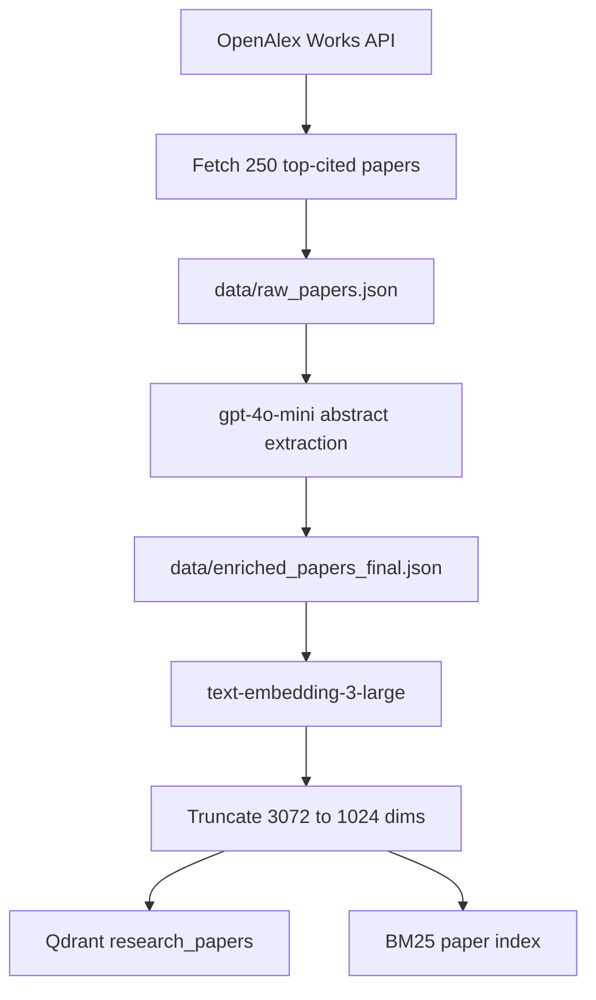
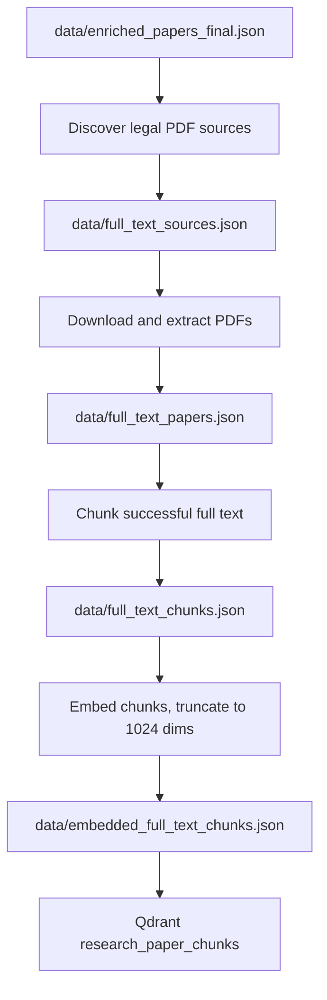
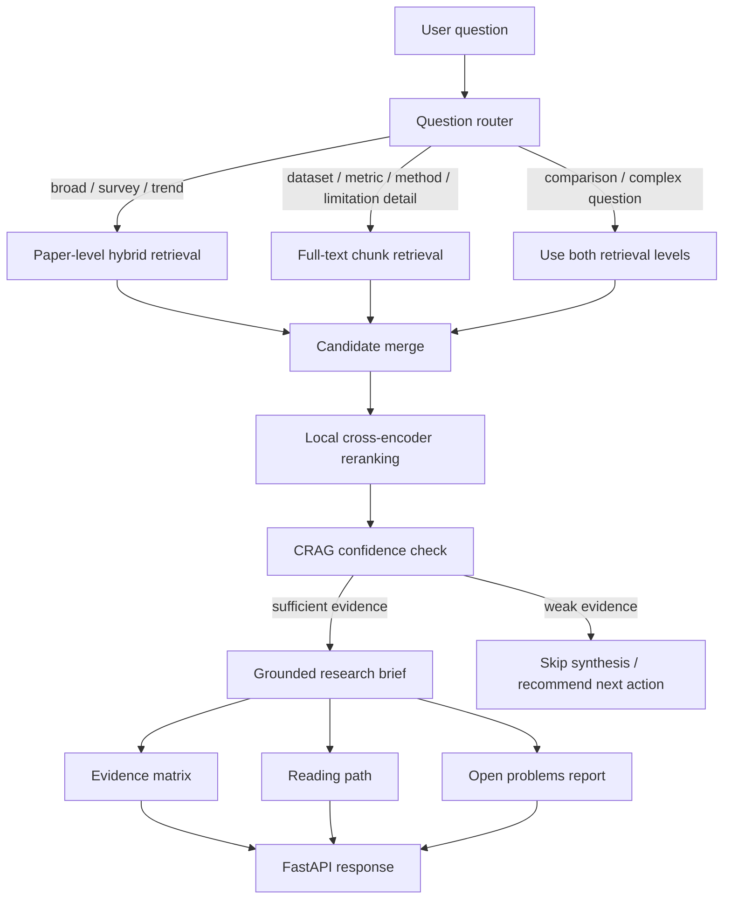

# Research Synthesis Engine - Revised Day-by-Day Build Plan

Window: 28 days
Current status: ingestion, paper-level retrieval, tool wrapper, full-text chunk indexing, query routing, unified retrieval, reranking, citation-aware scoring, retrieval evaluation, CRAG confidence assessment, research brief generation, evidence matrix generation, reading path generation, open-problems generation, the FastAPI backend, Day 20.5 API polish, the Day 21 Streamlit analyst workspace, Day 21.5 UI/trust/output polish, Day 22 context-aware query rewriting, Day 22.5 answer-quality/retrieval/UI cleanup, Day 24 research agent loop, Day 25 evaluation hardening, Day 26 agent API/UI integration, Day 27 latency/demo smoothness, Day 28 fast-first UI sections, and Day 28.5 full-text recovery are complete.

## Final Positioning

Research Synthesis Engine is a literature intelligence system for AI research papers. It ingests top-cited papers from OpenAlex, extracts structured metadata from abstracts, builds paper-level and full-text chunk-level retrieval indexes, and generates evidence-backed research analyst outputs from user questions.

The project is intentionally not a generic RAG chatbot. The final output should feel like a research analyst brief: a direct answer, research themes, an evidence matrix, a recommended reading path, open problems, and optional timeline/context.

## Current Corpus

```text
paper-level corpus: 250 papers
research topics: 5
papers per topic: 50
abstract/enriched paper embeddings: 250
BM25 paper documents: 250
legal full-text PDF sources discovered: 173
successfully extracted full-text papers: 152
full-text chunks: 4909
embedded full-text chunks: 4909
```

Qdrant collections:

```text
research_papers
-> 250 paper-level vectors from title, abstract, and structured metadata

research_paper_chunks
-> 4909 full-text chunk vectors from 152 open/full-text papers
```

## Research Topics

```text
1. Retrieval-Augmented Generation (RAG)
2. Transformers / Attention Mechanisms
3. LLM Evaluation & Hallucination Detection
4. AI Agents & Tool Use
5. Fine-tuning (LoRA / PEFT)
```

## Core Design Decisions

- Use OpenAlex instead of Semantic Scholar because OpenAlex worked reliably at this scale and provides open-access metadata.
- Use batch ingestion instead of Kafka because the corpus is finite, inspectable, and does not need real-time streaming.
- Use local BM25 and Qdrant for hybrid retrieval.
- Use `text-embedding-3-large` and store 1024-dimensional truncated vectors.
- Use `gpt-4o-mini` for cost-aware structured extraction from abstracts.
- Keep generated data and PDFs local; commit code, tests, docs, and reproducible commands.
- Use two retrieval levels: paper-level retrieval for broad discovery, full-text chunk retrieval for detailed evidence.
- Store full-text chunks in a separate Qdrant collection instead of mixing them with paper-level vectors.

---

## Architecture

### Offline Ingestion And Indexing



### Full-Text Expansion



### Live Query Flow



## Expected User Experience

The user should not need to know the exact papers in the corpus. The UI should show available research areas, suggested questions, and a free-text question box.

Example questions:

```text
What are the main approaches for reducing hallucinations in LLMs?
Which datasets and metrics are used to evaluate hallucination detection?
Compare RAG and self-verification methods for reducing hallucinations.
What are common limitations in AI agent tool-use papers?
Which LoRA/PEFT papers should I read first and why?
```

Expected output:

1. Direct answer
2. Research themes
3. Evidence matrix
4. Recommended reading path
5. Open problems
6. Optional timeline
7. Source citations and retrieved evidence snippets

---

# Completed Work

## Day 1: Project Skeleton + Schemas - Complete

Implemented:
- Repository structure: `ingestion/`, `retrieval/`, `agent/`, `tools/`, `api/`, `ui/`, `shared/`, `tests/`, `data/`, `docs/`
- `pyproject.toml`
- `.env.example`
- `shared/schemas.py`
- `docs/DECISIONS.md`
- Initial day-by-day plan in docs

Checkpoint:
```text
repo exists
schemas defined
dependencies installable
decision log started
```

## Day 2: OpenAlex Paper Ingestion - Complete

Implemented:
- `ingestion/fetch_papers.py`
- OpenAlex API ingestion for 5 topics
- 50 papers per topic
- Citation-count-oriented selection
- Abstract reconstruction from OpenAlex inverted index
- Missing abstract/title filtering

Local artifact:
```text
data/raw_papers.json -> 250 papers
```

Checkpoint:
```text
250 raw papers
5 topics
50 papers per topic
OpenAlex IDs and metadata retained
```

## Day 3: LLM Extraction From Abstracts - Complete

Implemented:
- `ingestion/extract.py`
- `gpt-4o-mini` structured extraction
- Pydantic validation
- Retry-once behavior
- Progress saving
- Mocked tests
- Manual spot-check document

Extracted fields:
```text
main_contribution
methodology
dataset_used
key_result
limitations
```

Local artifact:
```text
data/enriched_papers_final.json -> 250 papers
```

Important wording:
```text
missing dataset/result/limitation values use "not stated in abstract"
```

## Day 4: Paper-Level Embeddings - Complete

Implemented:
- `ingestion/embed.py`
- `text-embedding-3-large`
- 3072-dimensional OpenAI embeddings
- 1024-dimensional stored vectors via truncation
- Batched embedding
- Resume/skipping behavior

Local artifact:
```text
data/embedded_papers.json -> 250 embedded papers
```

Checkpoint:
```text
250 paper-level embeddings
stored dimensions: 1024
full model dimensions: 3072
```

## Day 5: Qdrant + BM25 Paper Indexing - Complete

Implemented:
- `retrieval/index_qdrant.py`
- `retrieval/build_bm25.py`
- Qdrant local/server support
- Stable UUIDv5 point IDs
- BM25 sparse index

Local artifacts:
```text
data/bm25_index.pkl
Qdrant collection: research_papers -> 250 points
```

Checkpoint:
```text
paper-level dense retrieval works
paper-level sparse retrieval works
manual sanity queries return relevant papers
```

## Day 6: Hybrid Retrieval Wrapper - Complete

Implemented:
- `retrieval/hybrid_search.py`
- Dynamic user query embedding
- Dense Qdrant search
- BM25 sparse search
- Candidate merge/deduplication
- Hybrid score
- Tests with mocked clients

Checkpoint:
```text
free-text question -> ranked candidate papers
no hardcoded questions or answers
```

## Day 7: Tool-Style Retrieval Interface - Complete

Implemented:
- `RetrievalRequest`
- `RetrievedPaper`
- `RetrievalResponse`
- `tools/research_retrieval.py`
- JSON CLI output
- Tool-facing error handling
- Tests with mocked retrieval

Checkpoint:
```text
retrieval has a stable schema for future API, agent, and UI layers
```

## Day 8: Full-Text Source Discovery - Complete

Implemented:
- `full_text/discover_sources.py`
- Existing arXiv source detection
- OpenAlex open-access PDF source discovery
- Source-type labeling
- Topic/source summaries
- Tests

Local artifact:
```text
data/full_text_sources.json
```

Result:
```text
checked: 250 papers
legal full-text sources available: 173
arXiv sources: 49
OpenAlex open-access PDF sources: 124
unavailable: 77
```

## Day 9: Full-Text Selection + PDF Extraction - Complete

Implemented:
- `full_text/select_sources.py`
- `full_text/download_extract.py`
- Topic-balanced source selection
- Expansion to all legal sources
- PDF download
- PDF text extraction using `pypdf`
- Failure recording without crashing the batch
- Tests

Local artifacts:
```text
data/full_text_selected.json
data/full_text_selected_all.json
data/full_text_papers.json
data/pdfs/
```

Result:
```text
legal PDF sources attempted: 173
successful full-text extractions: 131
failed downloads/extractions: 42
total extracted pages: 2533
total extracted text characters: 10343086
```

## Day 10: Full-Text Chunking + Qdrant Chunk Index - Complete

Implemented:
- `full_text/chunk_papers.py`
- `full_text/embed_chunks.py`
- `full_text/index_chunks_qdrant.py`
- Section-hinted chunking
- Chunk embeddings with `text-embedding-3-large`
- 1024-dimensional chunk vectors
- Qdrant chunk collection
- Tests

Local artifacts:
```text
data/full_text_chunks.json -> 4909 chunks
data/embedded_full_text_chunks.json -> 4909 embedded chunks
Qdrant collection: research_paper_chunks -> 4909 points
```

Checkpoint:
```text
chunk-level full-text retrieval works
live query returned detailed hallucination benchmark/dataset chunks
```

## Day 11: Query Router - Complete

Implemented:
- `retrieval/router.py`
- `QueryRoute` schema in `shared/schemas.py`
- Four route types:
  - `paper_level`
  - `chunk_level`
  - `hybrid_both`
  - `metadata_filter`
- Rule-based query signal scoring
- Ambiguous-query fallback to `hybrid_both`
- JSON CLI for route sanity checks
- Tests for broad, detailed, comparison, metadata, and ambiguous queries

Routing examples:

| Query | Route |
| --- | --- |
| What are the main approaches for reducing hallucinations? | paper_level |
| Which datasets are used for hallucination detection? | chunk_level |
| Compare RAG and self-verification methods. | hybrid_both |
| Show recent AI agent papers. | metadata_filter |
| Tell me about hallucination detection. | hybrid_both fallback |

`hybrid_both` behavior:
- Return paper-level results and chunk-level results as two separate result sets.
- Do not merge papers and chunks into one ranked list at the router stage.
- Day 12 context assembly can use paper results for broad coverage and chunk results for specific evidence.

Checkpoint:
```text
user question -> route decision with reason, confidence, and matched signals
```


## Day 12: Unified Retrieval Service - Complete

Implemented:
- `retrieval/unified_search.py`
- `UnifiedSearchRequest` and `UnifiedSearchResponse` schemas
- `RetrievedChunk` schema for full-text evidence chunks
- Router-driven execution for all four routes:
  - `paper_level`
  - `chunk_level`
  - `hybrid_both`
  - `metadata_filter`
- Paper retrieval through existing Qdrant + BM25 hybrid search
- Chunk retrieval through `research_paper_chunks`
- Metadata filtering from the local BM25 artifact paper metadata
- Separate paper/chunk result sets for `hybrid_both`
- Reranking and citation-aware scoring handoff
- JSON CLI sanity path
- Tests with mocked retrievers and offline CLI coverage

Checkpoint:
```text
one query -> route decision -> paper results, chunk results, or both separately
```

## Day 13: Local Cross-Encoder Reranking - Complete As Standalone Component

Implemented:
- `retrieval/rerank.py`
- Lazy-loaded local `sentence-transformers` cross-encoder support
- Candidate text builder for both paper-level records and full-text chunks
- Raw rerank score capture
- Normalized `rerank_score` in the 0..1 range
- Tests with mocked cross-encoder scoring

Integration note:
- The reranker is ready to be called by Day 12 unified retrieval.
- For `hybrid_both`, paper results and chunk results should be reranked within their own result sets first.

Checkpoint:
```text
candidate list + query -> reranked candidates with raw and normalized relevance scores
```

## Day 14: Citation-Aware Blended Scoring - Complete As Standalone Component

Implemented:
- Citation normalization with `log1p(citation_count)`
- Default blended score:
  `0.75 * rerank_score + 0.25 * normalized_citation_score`
- `citation_score` field
- `blended_score` field
- `score_breakdown` field with rerank/citation weights
- Tests for deterministic scoring and bad weight validation

Integration note:
- The scoring utility is ready for Day 12 unified retrieval output.
- Scores are interpreted within one candidate set; paper and chunk scores are not forced into one mixed ranking yet.

Checkpoint:
```text
reranked candidates -> citation-aware blended ranking with transparent score breakdown
```

## Day 15: Retrieval Evaluation Set - Complete

Implemented:
- `tests/fixtures/eval_queries.json` with 20 evaluation queries across all five topics
- `EvaluationQuery` schema
- Optional `expected_relevant_ids`, defaulting to `[]`
- `retrieval/evaluate.py` CLI runner
- Route accuracy over the full query set
- Topic hit rate and keyword hit rate as full-set sanity checks
- Recall@5, Recall@10, and MRR over only the labeled subset with non-empty `expected_relevant_ids`
- Transparent CLI output showing labeled vs. topic/keyword-only query counts
- Tests with mocked unified retrieval

Checkpoint:
```text
retrieval evaluation reports rigorous ID metrics separately from topic/keyword sanity checks
```

## Day 16: CRAG Confidence Guardrail - Complete

Implemented:
- `retrieval/confidence.py`
- `ConfidenceAssessment` schema
- Confidence score from:
  - top retrieval score
  - route confidence
  - result count
  - score consistency
  - topic agreement
  - paper/chunk agreement for `hybrid_both`
- Decisions:
  - `sufficient_evidence`
  - `broaden_search`
  - `ask_clarifying_question`
  - `insufficient_evidence`
- JSON CLI for saved unified responses or live queries
- Tests for high-confidence, no-result, low-score, ambiguous-route, and hybrid agreement cases

Checkpoint:
```text
unified retrieval response -> confidence assessment before synthesis
```

---

## Day 17: Research Brief Generator - Complete

Implemented:
- `agent/synthesis.py`
- `ResearchBrief`, `BriefTheme`, and `EvidenceSource` schemas
- CRAG-gated generation: low-confidence retrieval skips the LLM instead of producing unsupported answers
- Prompt contract that uses only retrieved papers/chunks and requires source IDs
- JSON-only generation path using `gpt-4o-mini`
- Mocked unit tests and low-confidence CLI coverage

Checkpoint:
```text
unified retrieval response -> confidence check -> grounded research brief or guarded skip
```

## Day 18: Evidence Matrix Generator - Complete

Implemented:
- `agent/evidence_matrix.py`
- `EvidenceMatrix` and `EvidenceMatrixRow` schemas
- Evidence rows with claim, supporting papers, methodology, dataset, key result, limitation, source IDs, evidence strength, and snippet
- JSON and Markdown output modes
- Deterministic tests using fixed retrieved examples

Checkpoint:
```text
retrieved evidence -> inspectable structured evidence matrix
```

---

# Upcoming Work

## Day 19: Reading Path + Open Problems - Complete

Implemented:
- `agent/guidance_common.py` for shared candidate normalization and source-ID validation
- `agent/reading_path.py` for staged reading paths
- `agent/open_problems.py` for grounded open-problems reports
- `agent/research_guidance.py` for combined Day 19 output from one unified retrieval response
- `ReadingPathItem`, `ReadingPathStage`, `ReadingPath`, `OpenProblem`, `OpenProblemsReport`, and `ResearchGuidanceResponse` schemas
- Deterministic candidate selection using retrieval score, citation count, year, evidence coverage, methodology diversity, and chunk support
- LLM-bounded explanation prompts with retry-once JSON parsing and strict ID validation
- Confidence-gated behavior for `sufficient_evidence`, `broaden_search`, `ask_clarifying_question`, and `insufficient_evidence`
- JSON/readable CLIs and mocked tests

Checkpoint:
```text
retrieved evidence -> confidence check -> reading path + grounded open problems
```

## Day 20: FastAPI Backend - Complete

Implemented:
- `api/main.py`
- `ApiQueryRequest` and `ApiGuidanceResponse` API schemas
- Thin API endpoints over existing retrieval and agent services:
```text
GET  /health
GET  /corpus/stats
POST /retrieve
POST /confidence
POST /brief
POST /evidence-matrix
POST /reading-path
POST /open-problems
POST /guidance
```
- `/guidance` runs retrieval once, assesses confidence once, then reuses those objects for brief, evidence matrix, reading path, and open-problems output
- Corpus stats from local JSON artifacts
- HTTP error mapping for retrieval/generation/service failures
- Mocked FastAPI `TestClient` tests with no OpenAI, Qdrant, OpenAlex, or cross-encoder calls

Checkpoint:
```text
backend can serve retrieval, confidence, synthesis, evidence, reading path, and open-problems responses
```

## Day 20.5: API Polish - Complete

Implemented:
- `POST /route` route preview without retrieval
- Canonical `question` request field with backward-compatible `query` alias
- UI-facing filters: `research_areas`, `publication_year_min`, `publication_year_max`, `full_text_only`, and `include_debug`
- Filter validation and clear warnings for post-retrieval filtering
- Debug mode for route signals, confidence signals, score breakdowns, and timing metrics
- Request ID middleware using `X-Request-ID`
- Structured API error responses with stable error codes
- Basic timing metrics for retrieval, confidence, brief, evidence matrix, reading path, open problems, and total request time
- CORS configuration through `RSE_CORS_ORIGINS`
- Safer health checks with `healthy`/`degraded` dependency status
- OpenAPI summaries/tags and expanded API tests

Checkpoint:
```text
FastAPI backend is stable enough for the Day 21 Streamlit analyst workspace
```

## Day 21: Streamlit Analyst Workspace - Complete

Goal: create a usable research analyst UI over the FastAPI backend.

Implemented:
- `ui/streamlit_app.py` for the Streamlit workspace
- `ui/api_client.py` for lightweight API calls and response shaping
- Suggested-question selector, free-text question box, topic filters, year filters, full-text evidence control, evidence-depth control, and diagnostics toggle
- Cheap route preview through `POST /route`
- Full research guidance through `POST /guidance`
- Tabs for brief, evidence matrix, reading path, open problems, sources, and diagnostics
- Health and corpus-stat status from `GET /health` and `GET /corpus/stats`
- Helper tests for payload construction, structured error formatting, API response flattening, request IDs, and HTTP error handling

Checkpoint:
```text
non-technical user can ask a research question and inspect evidence
```

## Day 21.5: Evidence-Gated Editorial Research Workspace

Goal: improve trust, answer quality, speed, and visual polish before storage cleanup.

Pass 1 - Trust + Stability: Complete
- Cross-encoder reranking falls back to retrieval scores when the optional local reranker cannot load.
- Low-confidence guidance returns a guarded non-answer instead of synthesizing unsupported claims.
- Low-confidence guidance skips evidence matrix, reading path, and open-problems generation.
- Full test suite passes with the stability changes.

Pass 2 - Output Quality: Complete
- The synthesis prompt now asks for a 2-3 paragraph direct answer, 3-5 source-backed themes, specific evidence bullets, and explicit limitations.
- The UI now includes a top supporting evidence section.
- Result sections are ordered by query intent: overview, comparison, evaluation, reading path, or limitations/open problems.
- Helper tests cover theme rows, top evidence ranking, and adaptive ordering.

Completed UI polish passes:
- Pass 3: Stable sidebar-controls layout with clean black/white visual theme.
- Pass 4: Results-page readability with answer cards, source cards, and scannable reading/open-problem sections.
- Pass 5: Evidence-gate display and guarded weak-evidence UI state.
- Pass 6: Loading/status workflow for route preview and full analysis calls.
- Pass 7: Demo script with strong questions and interview walkthrough.
- Pass 8: README updated to match the current API/UI workflow.

## Day 22: Context-Aware Query Rewriting

Goal: support follow-up research questions without rebuilding the corpus indexes.

Completed:
- Added `agent/query_rewriter.py` with LLM-first standalone query rewriting and heuristic fallback.
- Added optional `chat_history` to the main `/guidance` request path.
- `/guidance` preserves the original user question while retrieving with `standalone_query`.
- Streamlit keeps lightweight session chat memory and displays the rewritten retrieval query when used.
- Tests cover LLM rewrite, heuristic fallback, API retrieval with rewritten query, and UI payload formatting.

Checkpoint:
```text
contextual follow-up -> standalone query -> existing Qdrant/BM25 indexes -> confidence-gated answer
```

## Day 22.5: UI, Answer Quality, and Retrieval Polish - Complete

Goal: make the current system easier to use and more reliable before adding a larger agent loop.

Completed:
- Optional guidance sections fail softly: if evidence matrix, reading path, or open-problems generation fails, the core answer can still return with a quiet diagnostic note.
- Streamlit result warnings were reduced: normal corpus/filter/source notes move into Diagnostics instead of appearing as large warning boxes.
- Result tabs now use plain labels: Evidence Matrix, Reading Path, Open Problems, Sources, and Diagnostics.
- Sidebar controls were renamed for clarity: `Evidence depth` and `Full-text evidence only`.
- Sources tab now caps paper/chunk detail expanders and gives chunks meaningful paper-title/section/score labels.
- Synthesis prompt now answers concept-first, then evidence, with safer chatbot wording and explicit comparison-question guidance.
- Direct-answer citation guard ensures generated answers show source IDs when retrieved evidence supports the answer.
- Agent/tool-use task questions receive a narrow intent-aware ranking boost for survey/tool/API/planning/workflow evidence.
- Full suite passed with 210 tests.

Checkpoint:
```text
question -> readable answer -> quiet notes -> inspectable evidence tabs -> cited sources
```

## Day 23: Documentation + Commit Checkpoint - Complete

Goal: lock in the stable multi-turn UI and answer-quality work with accurate project documentation.

Completed:
- README updated with current phase status, validation count, API/UI behavior, follow-up support, fail-soft guidance, intent-aware reranking, and citation guard.
- Day-by-day plan updated to include Day 22.5 polish and the next agent-loop scope.
- Decision log updated for quiet diagnostics, fail-soft optional sections, narrow agent-ranking boosts, and direct-answer citation guarding.
- Current full test suite status: 215 tests passing.

Checkpoint:
```text
current code + docs accurately describe the working project state
```

## Day 24: Research Agent Loop Layer - Complete

Goal: formalize the current pipeline as an agent-style state loop without rewriting working retrieval or synthesis modules.

Implemented:
- Added `agent/research_graph.py`.
- Defined `ResearchAgentState` with original query, chat history, standalone query, retrieved papers, retrieved chunks, confidence decision, retry count, attempted queries, warnings, retrieval response, confidence, and brief fields.
- Wired existing modules as graph-style nodes:
  - Context rewrite
  - Unified search
  - CRAG confidence check
  - Synthesis
- Added a bounded low-confidence reflection/rewrite retry path.
- Kept the first version synchronous and dependency-injectable for reliable mocked tests.
- Added tests for high-confidence straight-through flow, retry success, retry limit stop, state initialization, and invalid retry configuration.

Checkpoint:
```text
query + chat history -> rewrite -> search -> confidence -> answer or bounded retry
```

## Day 25: Evaluation + Demo Hardening - Complete

Goal: prove quality and prepare the project for GitHub/interview use.

Implemented:
- Expanded `EvaluationQuery` with category, optional chat history, expected standalone-query keywords, and optional expected confidence decision.
- Expanded `tests/fixtures/eval_queries.json` from 20 to 25 queries.
- Added multi-turn contextual follow-up cases for query rewriting.
- Added out-of-corpus and weak-evidence cases for confidence-gating checks.
- Updated `retrieval/evaluate.py` to report rewrite keyword hit rate, confidence decision accuracy, and CRAG fallback success rate while preserving Recall@K/MRR only for the labeled relevant-ID subset.
- Added mocked tests for contextual rewriting and confidence/fallback metrics.
- README now describes evaluation coverage and runner outputs.

Checkpoint:
```text
evaluation covers routing, retrieval sanity, partial relevant-ID labels, query rewriting, and confidence fallback behavior
```

## Day 26: Agent API/UI Integration - Complete

Goal: expose the Day 24 research-agent loop without replacing the stable `/guidance` analyst workflow.

Implemented:
- Added `POST /agent/research` over `agent.research_graph.run_research_agent`.
- Returned original query, standalone query, attempted queries, retry count, confidence decision, retrieval counts, retrieval summary, confidence, brief, warnings, and non-streaming trace steps.
- Reused existing request validation, request IDs, structured errors, filters, debug control, and timing metrics.
- Added UI client helpers for calling the agent endpoint and flattening trace rows.
- Added a Diagnostics hook that can render an Agent Trace when an agent response is inspected.
- Added mocked API/UI tests for graph invocation, structured errors, request IDs, and trace formatting.
- Full suite passed with 221 tests.

Checkpoint:
```text
/question + chat history -> /agent/research -> bounded agent loop -> traceable response
```

## Day 27: Latency and Demo Smoothness - Complete

Goal: reduce perceived wait time and make demo latency measurable without changing the analyst output contract.

Implemented:
- Parallelized independent optional `/guidance` sections after the CRAG evidence gate passes: evidence matrix, reading path, and open problems.
- Preserved the existing `/guidance` response shape, warnings, request IDs, debug controls, and timing metrics.
- Improved Streamlit loading copy to show the actual high-level stages: context/routing, evidence search, confidence check, and brief/evidence-section generation.
- Added `tools/benchmark_latency.py` to measure `/guidance` and `/agent/research` wall time plus returned debug metrics for demo questions.
- Added tests for concurrent optional section execution and latency benchmark formatting.

Checkpoint:
```text
question -> one retrieval/confidence/brief path -> parallel optional sections -> measurable latency table
```

## Day 28: Fast-First UI Sections - Complete

Goal: show the core answer faster by moving heavy supporting sections behind explicit user actions.

Implemented:
- Added `/guidance` request flags: `include_evidence_matrix`, `include_reading_path`, and `include_open_problems`.
- Preserved API backward compatibility by keeping all optional sections enabled by default for direct API callers.
- Updated Streamlit's initial run to request the direct answer plus evidence matrix first.
- Added on-demand buttons in the Reading Path and Open Problems tabs.
- Reused existing `/reading-path` and `/open-problems` endpoints for on-demand section generation.
- Added tests proving heavy sections can be skipped and UI payload flags are correct.
- Live benchmark on the hallucination demo question improved the first `/guidance` response from about 21.3s full guidance to about 8.8s fast-first guidance.
- Full suite passed with 227 tests at that checkpoint; the current suite has 234 passing tests after the full-text recovery pass.

Checkpoint:
```text
run analysis -> direct answer + evidence matrix first -> reading path/open problems on demand
```


## Day 28.5: Full-Text Recovery Pass - Complete

Goal: improve full-text coverage for papers that were still abstract-only after the initial legal PDF extraction pass.

Implemented:
- Added `full_text/recover_sources.py` to audit abstract-only papers against public legal sources.
- Used existing arXiv identifiers, OpenAlex open-access PDF locations, arXiv title matches, and Semantic Scholar open-access PDF links as recovery candidates.
- Recovered 21 additional full-text papers.
- Sanitized extracted PDF text before JSON writes so invalid surrogate Unicode cannot corrupt `full_text_papers.json` or `full_text_chunks.json`.
- Rebuilt and embedded the expanded full-text chunk corpus.
- Reindexed Qdrant `research_paper_chunks` with 4,909 chunk points.
- Added tests for JSON sanitization in full-text paper/chunk writers and deterministic recovery helper behavior.

Checkpoint:
```text
full-text papers: 152
full-text chunks: 4909
embedded full-text chunks: 4909
Qdrant research_paper_chunks: 4909 points
tests: 234 passed
```

# Current Immediate Next Step

Start **Day 29: Final Demo QA and GitHub Polish**.

Recommended scope:
- Benchmark the fast-first UI/API path on the strongest demo questions.
- Manually verify the UI answer quality for 3-5 interview questions.
- Keep only the best questions in `docs/DEMO_SCRIPT.md`.
- Decide whether `/agent/research` should stay diagnostic-only or become a visible optional demo path.

# Minimum Viable Final Demo

If time gets tight, ship:

```text
paper-level + chunk-level retrieval
query router
research brief
simple evidence matrix
Streamlit UI
README with real corpus stats
```

Do not cut:
- real data
- citations/evidence
- retrieval transparency
- tests for external API boundaries

Can cut if needed:
- LangGraph
- MCP server boundary
- Langfuse
- deployment
- timeline view
