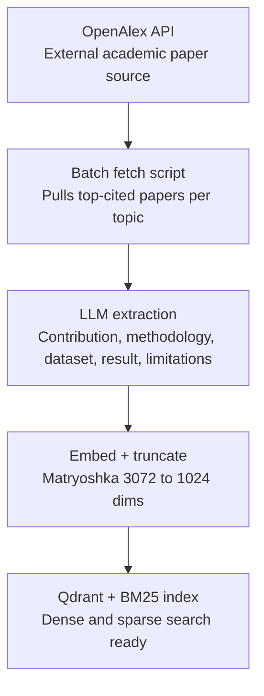
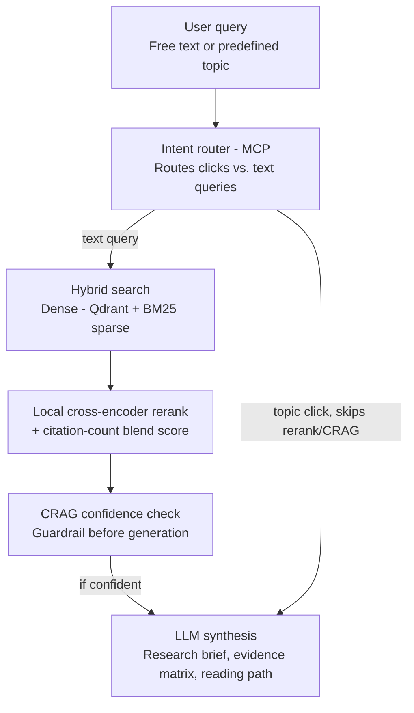

# Research Synthesis Engine — Day-by-Day Build Plan (22 Days Core + 3 Day Buffer)

Window: 20-25 days
Cost: Free apart from OpenAI usage (a few dollars total)

## Final Positioning

An agentic research synthesis engine that ingests academic papers (OpenAlex API), retrieves them using hybrid dense+sparse search with local cross-encoder reranking and citation-aware scoring, self-corrects low-confidence retrievals via a CRAG guardrail, and generates a research analyst brief: a direct answer, evidence-backed themes, a claim/evidence matrix, a recommended reading path, open problems, and an optional chronological evolution timeline — all with verifiable inline citations. Tools are exposed via MCP; key steps include human-in-the-loop review.

**Explicitly cut from the original design:** Apache Kafka / event streaming (batch ingestion is honest and sufficient at this data scale — reserved for a separate, genuinely-continuous-data project later). Cohere Rerank (swapped for a free, local, open-source cross-encoder).

**Kept, because these are the real technical differentiators:**
- CRAG (Corrective RAG) evaluation guardrail
- Two-stage hybrid search (dense + sparse/BM25)
- Local cross-encoder reranking + blended citation-count scoring
- Matryoshka embedding dimension truncation
- Research analyst outputs (brief, evidence matrix, reading path, optional timeline)

## Non-Negotiable Rules

- No fake metrics — every number in the README/demo comes from a real run.
- No hardcoded dashboard numbers — charts read from your DB/result files.
- Mock external APIs in tests.
- Keep a decision log (`docs/DECISIONS.md`).
- If a decision gate says cut something, cut it without reopening the debate.
- Ask when blocked rather than guessing at API/library behavior.

## Tech Stack (all free except OpenAI)

- **Ingestion:** Python batch scripts (no message broker)
- **Vector DB:** Qdrant (self-hosted, Docker, free)
- **Embeddings + LLM:** OpenAI (`text-embedding-3-large`, truncated to 1024 dims; a small model for extraction/synthesis) — only paid component
- **Sparse search:** BM25 (local, free — e.g. `rank_bm25` or Qdrant's native sparse vectors)
- **Reranking:** local cross-encoder (`sentence-transformers`, e.g. `ms-marco-MiniLM`) — free, no API, no rate limit
- **Orchestration:** LangGraph
- **Tool exposure:** MCP (FastMCP)
- **Backend:** FastAPI
- **Observability:** Langfuse (self-hosted, free) — optional if time allows
- **Frontend:** Streamlit
- **Deployment:** Docker Compose + Render free tier

---

## Pipeline Flowcharts

### Ingestion pipeline (offline, one-time batch job — Days 1–5)



### Retrieval pipeline (live, runs per user query — Days 8–17)



### Product output shape

The user does not need to know the exact papers in the corpus. The UI should show the five available research areas, suggested questions for each area, a free-text question box, and an optional corpus browser.

For a free-text research question such as:

```text
What are the main approaches for reducing hallucinations in LLMs?
```

the system should return:

1. **Direct Answer** — a concise answer grounded in retrieved papers.
2. **Research Themes** — grouped approaches or claims found in the evidence.
3. **Evidence Matrix** — theme/claim, supporting papers, key result, limitation, evidence strength.
4. **Recommended Reading Path** — which papers to read first and why.
5. **Open Problems** — gaps and unresolved issues surfaced by the retrieved literature.
6. **Optional Timeline** — chronological evolution of the area.

---

## Days 1–3: Foundation + Batch Ingestion

- Project skeleton: `pyproject.toml`, `.env.example`, `docs/DECISIONS.md`
- Folders: `ingestion/`, `retrieval/`, `agent/`, `tools/`, `api/`, `ui/`, `shared/`, `tests/`
- Pydantic schemas for: `Paper`, `EnrichedPaper`, `RetrievalResult`, `SynthesisOutput`
- `ingestion/fetch_papers.py` — batch script pulling from OpenAlex API for 5 topics (title, abstract, authors, citation count, year, IDs/links), sorted toward top-cited papers
- `ingestion/extract.py` — LLM call (small/cheap model) to parse abstracts into structured JSON (`main_contribution`, `methodology`, `dataset_used`, `key_result`, `limitations`) — batched, not streamed
- Save raw + enriched records to a local file/SQLite table (this is your "source of truth," replacing what Kafka topics did in the original design)
- Decision log entries: why batch not Kafka, why this data scale doesn't need a message broker, why local cross-encoder not Cohere

**Checkpoint:** running the ingestion script end-to-end produces enriched JSON records for all papers across all topics, no network calls in tests (mocked).

---

## Days 4–5: Embedding Pipeline + Qdrant + Matryoshka Truncation

- Qdrant running locally via Docker Compose, collection configured with payload metadata indices (topic, citation_count, arxiv_id)
- Embed enriched abstracts with `text-embedding-3-large`, truncate to 1024 dims (Matryoshka), upsert into Qdrant with full metadata payload
- Add BM25 sparse index over the same corpus (local, e.g. `rank_bm25`, or Qdrant's native sparse vector support)
- Verify: can re-run ingestion idempotently (re-upsert without duplicating) — this is your honest substitute for Kafka's "replayability" story
- Decision log entry: why 1024 dims, measured accuracy tradeoff vs. full 3072 (this is your "98% accuracy retained" resume claim — actually measure it, don't assume it)

**Checkpoint:** Qdrant holds embedded + BM25-indexed chunks for all ingested papers; a manual similarity search returns sensible results.

---

## Days 6–7: MCP Wrapper

- Wrap the retrieval tool (dense + sparse search over Qdrant) as an MCP server (FastMCP)
- LangGraph agent connects via MCP client instead of direct function call
- Record MCP tool calls in whatever trace/logging structure you're using
- Decision log entry: why MCP, what it demonstrates

**Checkpoint:** agent successfully calls the retrieval tool through the MCP client/server boundary.

---

## Days 8–11: Hybrid Retrieval + Reranking + Blended Scoring

- Day 8: Intent router node — routes direct topic clicks to fast metadata filtering (bypasses vector search entirely), routes free-text queries to the hybrid search path
- Day 9: Two-stage hybrid search — dense (Qdrant cosine similarity) + sparse (BM25) run in parallel, results merged (e.g. Reciprocal Rank Fusion)
- Day 10: Local cross-encoder reranking (`sentence-transformers`) on top-50 candidates from hybrid search, reducing to top-10
- Day 11: Blended scoring — combine reranker score with log-normalized citation count:
  `blended_score = (reranker_score * 0.7) + (ln(citation_count) * 0.3)`
  Measure and record actual retrieval quality (Recall@5/10, MRR) — real numbers, not assumed

**Checkpoint:** given a query, the pipeline returns a top-10 ranked list of papers with dense, sparse, rerank, and blended scores all visible/loggable for debugging.

---

## Days 12–14: CRAG Evaluation Guardrail

- Day 12: Build the evaluation node — measures proximity/confidence score of retrieved results before generation
- Day 13: Define and tune the confidence threshold; when below threshold, intercept the generation path (fallback: broaden search, ask clarifying question, or honestly state insufficient evidence)
- Day 14: **Human-in-the-loop review** — manually review a sample of CRAG decisions (did it correctly catch low-confidence cases? false positives?), measure this like TraceScope-style root-cause accuracy

**Checkpoint:** real numbers exist for how often CRAG intercepts, and whether those interceptions were justified on manual review. This is your strongest "evaluation" talking point.

---

## Days 15–17: Generation — Research Analyst Outputs

- Day 15: **Research Brief** — direct answer, research themes, what the literature agrees on, practical recommendation, and open problems from top retrieved papers, with inline citation chips `[Author et al., Year]`
- Day 16: **Evidence Matrix** — claim/theme, supporting papers, methodology, dataset, key result, limitation, citation footprint, and evidence strength built from retrieved papers and pre-extracted metadata
- Day 17: **Recommended Reading Path + Optional Timeline** — ordered reading path explaining which papers to read first and why; timeline remains a secondary/appendix view showing how the area evolved by year

**Checkpoint:** research brief, evidence matrix, and reading path work end-to-end from a single user query or topic selection. Timeline works as a supporting view.

---

## Day 18: Decision Gate

- On schedule → add Langfuse tracing for latency/token/cost visibility across the graph
- Behind schedule → skip Langfuse, move straight to packaging

---

## Days 19–20: API + Dashboard + Deployment

- Day 19: FastAPI endpoints (`/ingest`, `/query`, `/brief`, `/evidence-matrix`, `/reading-path`, `/timeline`, `/health`), tested with mocked providers
- Day 20: Streamlit dashboard — topic selector, suggested research questions, free-text question input, optional corpus browser, tabs for research brief/evidence matrix/reading path/timeline, retrieval debug panel (dense/sparse/rerank/blended scores visible)
- Docker Compose (Qdrant + API + dashboard), deploy to Render, seed with pre-ingested data so demo is never empty

**Checkpoint:** live, deployed link works end-to-end for all three features.

---

## Days 21–22: Docs, Video, Resume Package

- README order: what it is → product output (research brief, evidence matrix, reading path) → why hybrid+CRAG matters → measured findings (Recall@K, CRAG accuracy, Matryoshka accuracy tradeoff) → architecture diagram → demo workflow → setup → design decisions (why batch not Kafka, why local reranker not Cohere)
- 3–4 min demo video
- Resume bullets, adapted from the original guide but honestly scoped:
  - *"Designed a two-stage hybrid retrieval architecture (dense + BM25 sparse) with local cross-encoder reranking and log-normalized citation-count blending, measured via Recall@K and MRR."*
  - *"Built a Corrective RAG (CRAG) evaluation guardrail that intercepts low-confidence retrievals before generation, reducing hallucination risk — validated via human-reviewed sample."*
  - *"Reduced embedding storage footprint via Matryoshka dimension truncation (3072→1024), measuring real accuracy retention rather than assuming it."*
  - *"Generated research analyst outputs from retrieved academic papers: direct-answer briefs, claim/evidence matrices, and recommended reading paths with inline citations."*
  - *"Exposed retrieval tools via MCP, integrated with a LangGraph agent for modular, standardized tool orchestration."*

**Checkpoint:** project is demo-ready, all metrics are real, story is clear.

---

## Days 23–25: Buffer

- Absorb whatever slipped
- If nothing slipped: add the extensions below, in priority order
- Practice your 2-minute explanation; prep answers for "why not Kafka," "why local reranker," "how did you measure Matryoshka accuracy retention," "what does CRAG actually catch"

---

# Extensions (only after core is fully shipped)

1. **Langfuse tracing** (if skipped at Day 18 gate) — full latency/cost/token visibility
2. **A second, genuinely continuous data source** (e.g., live GitHub events or an RSS feed) — this is where Kafka would become honestly justified; keep this as the seed of your *separate* streaming-agent project, not a retrofit here
3. **GitHub Actions CI** — regression tests for retrieval quality (fail build if Recall@K drops below threshold)
4. **React/Next.js frontend** — only after everything above, lowest priority
5. **Private/self-documentation RAG track** — same isolated-collection pattern discussed earlier, if you still want it

---

# Minimum Viable Fallback

If even 22 days is tight, ship this instead:
- Batch ingestion (Days 1–3) + embeddings/Qdrant (Days 4–5)
- Skip MCP, skip hybrid — vector-only retrieval
- Skip CRAG — just a fixed top-k answer
- One feature only (Research Brief), skip Evidence Matrix and Reading Path
- Streamlit dashboard, deployed, README with real Recall@K numbers

Still a complete, honest, deployed RAG project — just without the advanced differentiators.
